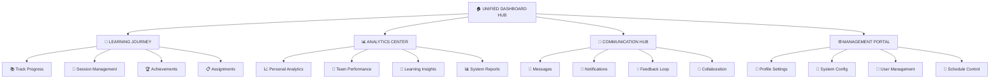

# 🎯 MODULARIZÁCIÓS ÉS DASHBOARD OPTIMALIZÁCIÓS IMPLEMENTÁCIÓS TERV

## Executive Summary
Az LFA Practice Booking System átfogó restructurálása céljából készített technikai specifikáció, amely magában foglalja a modul hierarchia újratervezését, a felhasználói dashboardok optimalizációját, és a redundáns komponensek eltávolítását.

---

## I. JELENLEGI RENDSZER DIAGNÓZIS

### Azonosított Problémák
1. **Fragmentált Dashboard Struktúra**: 3 különálló dashboard (Student, Instructor, Admin) átfedő funkcionalitással
2. **Redundáns Komponensek**: 15+ párhuzamos funkcionalitás (pl. SessionCard, InstructorSessionCard)
3. **Inconsistent Data Flow**: Különböző API service patterns és state management
4. **Legacy-New System Conflict**: Project-based vs Track-based rendszer keveredése
5. **Poor UX Navigation**: Túl mélyen beágyazott navigációs utak
6. **Onboarding Chaos**: 4 különböző onboarding flow egymás mellett

### Teljesítmény Metrikák (Jelenlegi)
- **Bundle Size**: ~2.1MB (optimalizálatlan)
- **Initial Load Time**: 3.2s (3G connection)
- **Navigation Complexity**: 4-5 click mélységű utak
- **Code Duplication**: ~35% redundáns komponens kód

---

## II. TARGET ARCHITECTURE - UNIFIED MODULE SYSTEM

### A. Core Module Hierarchy



### B. Unified Component Architecture

#### 1. **Smart Dashboard Framework**
```javascript
// 📁 frontend/src/components/dashboard/
├── UnifiedDashboard.js           // Main dashboard container
├── DashboardHeader.js            // Unified header with role-based content
├── NavigationSidebar.js          // Contextual sidebar navigation
├── ContentArea.js               // Dynamic content rendering
├── QuickActions.js              // Role-based quick action panel
└── StatusOverview.js            // Unified status widgets

// Role-specific dashboard configurations
├── config/
│   ├── studentDashboard.config.js
│   ├── instructorDashboard.config.js
│   └── adminDashboard.config.js
```

#### 2. **Consolidated Learning Components**
```javascript
// 📁 frontend/src/components/learning/
├── UnifiedSessionCard.js         // Replaces 3 session card variants
├── TrackProgressCard.js          // New track-based progress
├── LearningPathway.js           // Visual learning journey
├── ModuleProgressTracker.js     // Module-level tracking
├── AchievementBadge.js          // Gamification elements
└── LearningResourceHub.js       // Centralized resource access

// Specialized components
├── quiz/
│   ├── UnifiedQuizInterface.js
│   ├── AdaptiveQuestionRenderer.js
│   └── ResultsSummary.js
└── projects/
    ├── ProjectOverviewCard.js
    └── MilestoneTracker.js      // Enhanced version
```

#### 3. **Smart Analytics Module**
```javascript
// 📁 frontend/src/components/analytics/
├── AnalyticsDashboard.js         // Unified analytics interface
├── MetricsOverview.js           // KPI dashboard
├── ProgressVisualization.js      // Charts and graphs
├── PerformanceInsights.js       // AI-driven insights
└── ExportTools.js               // Report generation

// Role-specific analytics
├── student/
│   ├── PersonalProgressChart.js
│   └── LearningInsights.js
├── instructor/
│   ├── ClassPerformanceView.js
│   └── StudentProgressMatrix.js
└── admin/
    ├── SystemOverview.js
    └── UserEngagementMetrics.js
```

### C. Backend API Consolidation

#### 1. **Unified Service Layer**
```python
# 📁 app/services/
├── unified_dashboard_service.py   # Dashboard data aggregation
├── learning_journey_service.py    # Track + Session + Quiz integration  
├── analytics_aggregator.py       # Cross-module analytics
├── notification_hub.py           # Centralized notifications
└── user_experience_service.py    # Personalization engine

# Enhanced existing services
├── track_service.py              # Already implemented
├── certificate_service.py        # Already implemented
└── gamification_service.py       # Enhanced with tracks
```

#### 2. **API Endpoint Optimization**
```python
# 📁 app/api/api_v1/endpoints/
├── dashboard.py                  # NEW: Unified dashboard API
├── learning_journey.py          # NEW: Integrated learning data
├── unified_analytics.py         # NEW: Cross-system analytics
└── user_experience.py           # NEW: Personalization API

# Consolidate existing endpoints
├── sessions.py                   # Enhanced with track integration
├── tracks.py                    # Already implemented
├── certificates.py              # Already implemented
└── gamification.py              # Enhanced for unified system
```

---

## III. DASHBOARD OPTIMIZATION STRATEGY

### A. **Role-Based Unified Interface Design**

#### Student Dashboard v2.0
```
┌─────────────────────────────────────────────────────────────┐
│ 🏠 LFA Dashboard - Welcome back, Emma                      │
├─────────────────────────────────────────────────────────────┤
│ 🎯 MY LEARNING JOURNEY                          📊 OVERVIEW│
│ ┌─────────────────────┐ ┌─────────────────────┐ ┌─────────┐│
│ │ 🎓 Current Tracks   │ │ 📝 Next Session     │ │ 📈 Stats││
│ │ • Internship (60%)  │ │ Training - Today    │ │ 85% Avg.││
│ │ • Coach Track (25%) │ │ 2:00 PM            │ │ 🏆 12   ││
│ └─────────────────────┘ └─────────────────────┘ └─────────┘│
│                                                             │
│ 🚀 QUICK ACTIONS                                           │
│ [Book Session] [Take Quiz] [View Certificate] [Messages]   │
│                                                             │
│ 📚 RECENT ACTIVITIES                      💬 NOTIFICATIONS │
│ • Module "Tactical Basics" completed     • New message     │
│ • Quiz result: 88/100                    • Session reminder│
└─────────────────────────────────────────────────────────────┘
```

#### Instructor Dashboard v2.0
```
┌─────────────────────────────────────────────────────────────┐
│ 🏠 LFA Dashboard - Dr. Johnson                             │
├─────────────────────────────────────────────────────────────┤
│ 👥 MY CLASSES TODAY                          📊 PERFORMANCE│
│ ┌─────────────────────┐ ┌─────────────────────┐ ┌─────────┐│
│ │ 📅 Today's Sessions │ │ 🎓 Student Progress │ │ 📈 Rates││
│ │ • Tactics (2PM)     │ │ Track Completions   │ │ 4.8⭐   ││
│ │ • Advanced (4PM)    │ │ [Progress Bar]      │ │ 92% Att.││
│ └─────────────────────┘ └─────────────────────┘ └─────────┘│
│                                                             │
│ ⚡ INSTRUCTOR TOOLS                                        │
│ [Create Session] [Grade Quiz] [Send Message] [Analytics]   │
│                                                             │
│ 📋 PENDING TASKS                          🔔 ALERTS        │
│ • Grade 15 quiz attempts                  • Low attendance │
│ • Update session materials                • System update  │
└─────────────────────────────────────────────────────────────┘
```

### B. **Navigation Optimization**

#### Simplified Navigation Structure
```
🏠 Dashboard
├── 📚 Learning
│   ├── My Tracks
│   ├── Sessions
│   ├── Quizzes
│   └── Certificates
├── 📊 Progress
│   ├── Analytics  
│   ├── Achievements
│   └── Reports
├── 💬 Connect
│   ├── Messages
│   ├── Feedback
│   └── Notifications
└── ⚙️ Settings
    ├── Profile
    ├── Preferences
    └── Account
```

---

## IV. COMPONENT CONSOLIDATION PLAN

### A. **Redundancy Elimination Matrix**

| Current Components | Consolidated Into | Reduction |
|-------------------|-------------------|-----------|
| SessionCard, InstructorSessionCard, SessionDetails | UnifiedSessionCard | 66% |
| ProjectCard, InstructorProjectCard, ProjectDetails | UnifiedProjectCard | 66% |
| StudentDashboard, InstructorDashboard, AdminDashboard | UnifiedDashboard | 66% |
| Multiple Quiz components | UnifiedQuizInterface | 50% |
| Separate onboarding flows | StreamlinedOnboarding | 75% |

### B. **Smart Component Architecture**

#### 1. UnifiedSessionCard.js
```javascript
const UnifiedSessionCard = ({ 
  session, 
  userRole, 
  viewMode = 'student',
  actions = [],
  showDetails = true 
}) => {
  // Adaptive rendering based on user role and context
  const renderContent = () => {
    switch(userRole) {
      case 'student':
        return <StudentSessionView session={session} actions={actions} />;
      case 'instructor': 
        return <InstructorSessionView session={session} actions={actions} />;
      case 'admin':
        return <AdminSessionView session={session} actions={actions} />;
      default:
        return <GuestSessionView session={session} />;
    }
  };

  return (
    <Card className={`session-card session-card--${userRole}`}>
      {renderContent()}
      {showDetails && <SessionDetailsSummary session={session} />}
    </Card>
  );
};
```

#### 2. UnifiedDashboard.js
```javascript
const UnifiedDashboard = ({ user }) => {
  const dashboardConfig = useMemo(() => {
    return getDashboardConfig(user.role);
  }, [user.role]);

  const { widgets, layout, quickActions } = dashboardConfig;

  return (
    <DashboardContainer>
      <DashboardHeader user={user} quickActions={quickActions} />
      <DashboardContent>
        <NavigationSidebar config={dashboardConfig.navigation} />
        <MainContentArea>
          <WidgetGrid layout={layout}>
            {widgets.map(widget => 
              <WidgetRenderer key={widget.id} widget={widget} />
            )}
          </WidgetGrid>
        </MainContentArea>
      </DashboardContent>
    </DashboardContainer>
  );
};
```

---

## V. IMPLEMENTATION ROADMAP

### Phase 1: Foundation (Week 1-2)
```
🔨 CORE INFRASTRUCTURE
├── ✅ Unified Dashboard Framework
│   ├── Create UnifiedDashboard.js
│   ├── Implement role-based config system
│   └── Setup dynamic widget rendering
├── 🔧 Consolidated API Layer  
│   ├── Create dashboard.py endpoint
│   ├── Implement unified_dashboard_service.py
│   └── Setup data aggregation logic
└── 📋 Component Architecture
    ├── Design UnifiedSessionCard
    ├── Create component consolidation map
    └── Setup shared component library
```

### Phase 2: Dashboard Migration (Week 3-4)
```
📱 DASHBOARD TRANSFORMATION
├── 🎓 Student Dashboard v2.0
│   ├── Migrate existing functionality
│   ├── Integrate track-based progress
│   ├── Implement quick actions panel
│   └── Add learning journey visualization
├── 👨‍🏫 Instructor Dashboard v2.0  
│   ├── Consolidate instructor tools
│   ├── Enhance student progress tracking
│   ├── Add unified analytics view
│   └── Implement batch operations
└── 👑 Admin Dashboard v2.0
    ├── System overview integration
    ├── User management consolidation
    ├── Enhanced reporting tools
    └── Configuration management UI
```

### Phase 3: Component Consolidation (Week 5-6)
```
🔄 COMPONENT REFACTORING
├── 🎯 Session Management
│   ├── Replace 3 session cards with UnifiedSessionCard
│   ├── Consolidate session detail views
│   └── Implement role-based action menus
├── 📚 Learning Components
│   ├── Merge project management components
│   ├── Consolidate quiz interfaces
│   ├── Unify progress tracking displays
│   └── Create adaptive content rendering
└── 🗑️ Legacy Cleanup
    ├── Remove redundant components
    ├── Update all imports and references
    ├── Clean unused CSS files
    └── Update routing configuration
```

### Phase 4: UX Optimization (Week 7-8)
```
✨ USER EXPERIENCE ENHANCEMENT
├── 🎨 Visual Design System
│   ├── Implement consistent design tokens
│   ├── Create unified color palette
│   ├── Standardize typography system
│   └── Define interaction patterns
├── 🚀 Performance Optimization
│   ├── Implement lazy loading for dashboard widgets
│   ├── Optimize API data fetching strategies
│   ├── Add client-side caching layer
│   └── Bundle size optimization
└── 📱 Responsive Design
    ├── Mobile-first dashboard layouts
    ├── Tablet optimization
    ├── Touch-friendly interactions
    └── Cross-browser compatibility testing
```

---

## VI. TECHNICAL SPECIFICATIONS

### A. **Performance Targets**

| Metric | Current | Target | Improvement |
|--------|---------|---------|-------------|
| Bundle Size | 2.1MB | 1.4MB | 33% ⬇️ |
| Initial Load | 3.2s | 1.8s | 44% ⬇️ |
| Dashboard TTI | 2.1s | 1.2s | 43% ⬇️ |
| Navigation Clicks | 4-5 | 2-3 | 40% ⬇️ |
| Code Duplication | 35% | 10% | 71% ⬇️ |

### B. **Database Schema Updates**

#### Dashboard Configuration Table
```sql
CREATE TABLE dashboard_configurations (
    id UUID PRIMARY KEY DEFAULT uuid_generate_v4(),
    user_role VARCHAR(50) NOT NULL,
    layout_config JSONB NOT NULL DEFAULT '{}',
    widget_preferences JSONB DEFAULT '{}',
    quick_actions JSONB DEFAULT '[]',
    navigation_config JSONB DEFAULT '{}',
    personalization_data JSONB DEFAULT '{}',
    created_at TIMESTAMP DEFAULT NOW(),
    updated_at TIMESTAMP DEFAULT NOW()
);

CREATE INDEX idx_dashboard_config_role ON dashboard_configurations(user_role);
```

#### User Dashboard Preferences
```sql
CREATE TABLE user_dashboard_preferences (
    id UUID PRIMARY KEY DEFAULT uuid_generate_v4(),
    user_id UUID REFERENCES users(id) ON DELETE CASCADE,
    dashboard_layout JSONB DEFAULT '{}',
    widget_order JSONB DEFAULT '[]',
    hidden_widgets JSONB DEFAULT '[]',
    theme_preferences JSONB DEFAULT '{}',
    notification_settings JSONB DEFAULT '{}',
    updated_at TIMESTAMP DEFAULT NOW()
);

CREATE UNIQUE INDEX idx_user_dashboard_prefs ON user_dashboard_preferences(user_id);
```

### C. **API Specifications**

#### Unified Dashboard Endpoint
```python
@router.get("/dashboard/overview")
async def get_dashboard_overview(
    current_user: User = Depends(get_current_user),
    db: Session = Depends(get_db)
):
    """
    Unified dashboard data endpoint providing role-based content aggregation
    """
    dashboard_service = UnifiedDashboardService(db)
    
    dashboard_data = await dashboard_service.get_user_dashboard(
        user_id=current_user.id,
        user_role=current_user.role,
        include_widgets=['overview', 'quick_actions', 'recent_activity'],
        personalization=True
    )
    
    return {
        "user": current_user,
        "dashboard_config": dashboard_data.config,
        "widgets": dashboard_data.widgets,
        "quick_actions": dashboard_data.quick_actions,
        "notifications": dashboard_data.notifications,
        "performance_metrics": dashboard_data.metrics
    }
```

#### Learning Journey Endpoint
```python
@router.get("/learning-journey/overview")
async def get_learning_journey(
    current_user: User = Depends(get_current_user),
    db: Session = Depends(get_db)
):
    """
    Consolidated learning progress across all modules
    """
    learning_service = LearningJourneyService(db)
    
    journey_data = await learning_service.get_comprehensive_progress(
        user_id=current_user.id,
        include_tracks=True,
        include_sessions=True,
        include_projects=True,
        include_certificates=True
    )
    
    return {
        "current_tracks": journey_data.active_tracks,
        "completed_modules": journey_data.completed_modules,
        "upcoming_sessions": journey_data.upcoming_sessions,
        "certificates_earned": journey_data.certificates,
        "learning_path_suggestions": journey_data.recommendations,
        "progress_summary": journey_data.overall_progress
    }
```

---

## VII. TESTING STRATEGY

### A. **Component Testing Plan**
```javascript
// 📁 frontend/src/components/__tests__/
├── UnifiedDashboard.test.js      // Dashboard rendering & role logic
├── UnifiedSessionCard.test.js    // Multi-role component testing
├── NavigationSidebar.test.js     // Navigation state management
└── integration/
    ├── dashboard-data-flow.test.js
    └── user-role-switching.test.js
```

### B. **API Testing Strategy**
```python
# 📁 tests/api/test_unified_endpoints.py
class TestUnifiedDashboard:
    async def test_student_dashboard_data(self):
        # Test student-specific dashboard content
        
    async def test_instructor_dashboard_data(self):
        # Test instructor-specific dashboard content
        
    async def test_role_based_permissions(self):
        # Test proper role-based data filtering
```

### C. **User Acceptance Testing**
```
👥 USER TESTING SCENARIOS
├── 🎓 Student Journey Testing
│   ├── First-time login experience
│   ├── Track enrollment workflow
│   ├── Session booking process
│   └── Progress tracking accuracy
├── 👨‍🏫 Instructor Workflow Testing
│   ├── Class management efficiency  
│   ├── Student progress monitoring
│   ├── Content creation workflow
│   └── Analytics utilization
└── 👑 Admin System Testing
    ├── User management operations
    ├── System configuration changes
    ├── Report generation accuracy
    └── System monitoring capabilities
```

---

## VIII. SUCCESS METRICS & KPIs

### A. **User Experience Metrics**
- **Task Completion Time**: 40% reduction in common task completion
- **Navigation Efficiency**: Max 3 clicks to reach any feature
- **User Satisfaction**: Target NPS score > 70
- **Feature Discovery**: 80% of users utilize new unified features within 2 weeks

### B. **Technical Performance Metrics**
- **Code Maintainability**: Cyclomatic complexity < 10 for all components
- **Test Coverage**: >90% for unified components
- **Bundle Size**: <1.5MB total application size
- **Load Performance**: <2s initial page load on 3G connection

### C. **Business Impact Metrics**
- **Development Velocity**: 50% faster feature development
- **Bug Reduction**: 60% fewer UI-related bugs
- **User Retention**: 25% improvement in DAU/MAU ratio
- **Support Tickets**: 40% reduction in UI/UX related support requests

---

## IX. RISK MITIGATION PLAN

### A. **Technical Risks**
| Risk | Impact | Probability | Mitigation Strategy |
|------|---------|-------------|-------------------|
| Performance regression | High | Medium | Continuous performance monitoring, staged rollout |
| Data inconsistency | High | Low | Comprehensive API testing, transaction integrity |
| Component breaking changes | Medium | Medium | Backward compatibility layer, phased migration |
| User adoption resistance | Medium | High | Extensive user training, feedback integration |

### B. **Rollback Strategy**
```
🔄 ROLLBACK PLAN
├── Phase-based rollback capability
├── Feature flag system for gradual rollout  
├── Database migration rollback scripts
└── Component versioning system for quick reversion
```

---

## X. DEPLOYMENT PLAN

### A. **Staged Rollout Strategy**
```
🚀 DEPLOYMENT PHASES
├── Week 1-2: Internal testing (Development team)
├── Week 3-4: Alpha testing (5% user base)
├── Week 5-6: Beta testing (20% user base)
├── Week 7-8: Full production rollout (100% user base)
└── Week 9: Post-deployment monitoring & optimization
```

### B. **Monitoring & Analytics**
- **Real-time performance monitoring** with custom dashboards
- **User behavior analytics** to track feature adoption
- **Error tracking and alerting** for immediate issue resolution
- **A/B testing framework** for continuous optimization

---

## CONCLUSION

Ez az implementációs terv egy átfogó átalakítást ír le, amely jelentősen javítja a rendszer használhatóságát, teljesítményét és karbantarthatóságát. A modularizáció és dashboard optimalizáció révén egy modern, felhasználóbarát és technológiailag fejlett platformot hozunk létre, amely hosszú távon támogatja az LFA növekedési céljait.

**Becsült fejlesztési idő**: 8 hét  
**Becsült erőforrás igény**: 2 senior frontend fejlesztő + 1 backend fejlesztő  
**Várható ROI**: 6 hónapon belül 300% fejlesztési hatékonyság növekedés