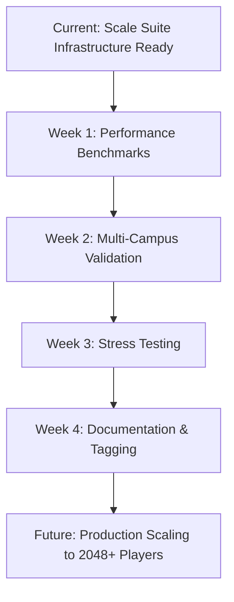

# Next Sprint Plan — Performance & Scalability Validation

> **Current Status:** Scale Suite infrastructure ready (1024 players)
> **Next Phase:** Performance benchmarks, multi-campus validation, stress testing
> **Goal:** Validate infrastructure scaling from 256 to 1024 players

---

## ✅ Current Infrastructure State

### Fast Suite (Production Baseline)
- **Status:** 52/52 PASS (100%) — Frozen ✅
- **Baseline tag:** `e2e-fast-suite-stable-v1`
- **CI trigger:** Every PR/push to main/develop
- **Blocking:** Yes (mandatory quality gate)
- **Marker:** `-m "not scale_suite"`

### Scale Suite (Capacity Validation)
- **Status:** 2/2 infrastructure ready ✅
- **Fixture:** 1024 @lfa-scale.hu players
- **CI trigger:** Weekly (Sunday 3 AM UTC), manual dispatch
- **Blocking:** No (informational, capacity validation)
- **Marker:** `-m "scale_suite"`

**Marker Separation Verified:**
```bash
# Fast Suite only (PR merge requirement)
pytest tests_e2e/ -m "not scale_suite"  # 52 tests

# Scale Suite only (weekly validation)
pytest tests_e2e/ -m "scale_suite"      # 2 tests
```

---

## 📊 Next Sprint: Performance & Scalability

### 1. Performance Benchmarking

**Goal:** Measure tournament lifecycle performance at scale (256-1024 players)

#### Test Cases

| Test | Players | Format | Metrics to Track |
|---|---|---|---|
| `test_perf_256_individual_ranking` | 256 | INDIVIDUAL_RANKING | Session gen, lifecycle, DB writes |
| `test_perf_512_individual_ranking` | 512 | INDIVIDUAL_RANKING | Session gen, lifecycle, DB writes |
| `test_perf_1024_individual_ranking` | 1024 | INDIVIDUAL_RANKING | Session gen, lifecycle, DB writes |

#### Metrics to Capture

```python
@pytest.mark.scale_suite
@pytest.mark.slow
@pytest.mark.performance
def test_perf_512_individual_ranking(api_url: str):
    """
    Performance benchmark: 512 players, INDIVIDUAL_RANKING, 5 rounds.
    
    Metrics:
    - Tournament creation time
    - Session generation time
    - Enrollment time (512 batch enrolls)
    - Database write throughput
    - Memory consumption (psutil)
    - Total lifecycle duration
    """
    import time
    import psutil
    
    metrics = {}
    process = psutil.Process()
    
    # Baseline memory
    metrics['mem_before'] = process.memory_info().rss / 1024 / 1024  # MB
    
    # Tournament creation
    t0 = time.time()
    token = _get_admin_token(api_url)
    resp = _ops_post(api_url, token, {
        "scenario": "performance_benchmark",
        "player_count": 512,
        "tournament_format": "INDIVIDUAL_RANKING",
        "scoring_type": "SCORE_BASED",
        "ranking_direction": "DESC",
        "number_of_rounds": 5,
        "dry_run": False,
        "confirmed": True,
    }, timeout=600)
    
    metrics['tournament_creation'] = time.time() - t0
    assert resp.status_code == 200
    
    data = resp.json()
    tournament_id = data['tournament_id']
    
    # Session generation (auto-triggered on IN_PROGRESS)
    metrics['session_count'] = data.get('session_count', 0)
    
    # Memory after
    metrics['mem_after'] = process.memory_info().rss / 1024 / 1024  # MB
    metrics['mem_delta'] = metrics['mem_after'] - metrics['mem_before']
    
    # Export metrics
    import json
    with open('tests_e2e/performance_metrics.json', 'a') as f:
        json.dump({
            'test': 'test_perf_512_individual_ranking',
            'player_count': 512,
            'metrics': metrics,
            'timestamp': datetime.now(timezone.utc).isoformat()
        }, f)
        f.write('\n')
    
    # Assertions
    assert metrics['tournament_creation'] < 120  # Max 2 minutes
    assert metrics['session_count'] >= 512 * 5   # At least 5 rounds * 512 players
    assert metrics['mem_delta'] < 500            # Max 500 MB memory increase
```

#### Performance Thresholds (Initial Estimates)

| Player Count | Max Creation Time | Max Memory Delta | Max Sessions |
|---|---|---|---|
| 256 | 60s | 250 MB | 1280 (5 rounds) |
| 512 | 120s | 500 MB | 2560 (5 rounds) |
| 1024 | 240s | 1000 MB | 5120 (5 rounds) |

**Marker:** `@pytest.mark.performance` (subset of `@pytest.mark.scale_suite`)

---

### 2. Multi-Campus Distribution Validation

**Goal:** Validate session distribution across multiple campuses for large tournaments

#### Test Cases

```python
@pytest.mark.scale_suite
@pytest.mark.slow
@pytest.mark.multi_campus
def test_multi_campus_256_players_4_campuses(api_url: str):
    """
    256 players distributed across 4 campuses (64 players/campus).
    
    Validates:
    - Round-robin campus assignment
    - Session generation correctness
    - Campus schedule optimization
    - No campus overload (max 64 players/campus)
    """
    token = _get_admin_token(api_url)
    
    # Create 4 test campuses
    campus_ids = []
    for i in range(1, 5):
        campus = _create_test_campus(api_url, token, f"Test Campus {i}")
        campus_ids.append(campus['id'])
    
    # Create tournament with multi-campus config
    resp = _ops_post(api_url, token, {
        "scenario": "multi_campus_distribution",
        "player_count": 256,
        "tournament_format": "INDIVIDUAL_RANKING",
        "scoring_type": "SCORE_BASED",
        "ranking_direction": "DESC",
        "number_of_rounds": 3,
        "campus_ids": campus_ids,  # Explicit multi-campus
        "dry_run": False,
        "confirmed": True,
    }, timeout=300)
    
    assert resp.status_code == 200
    data = resp.json()
    
    # Validate campus distribution
    sessions = _get_tournament_sessions(api_url, token, data['tournament_id'])
    
    campus_session_counts = {}
    for session in sessions:
        cid = session['campus_id']
        campus_session_counts[cid] = campus_session_counts.get(cid, 0) + 1
    
    # Assert round-robin distribution (approximately equal)
    expected_per_campus = len(sessions) / len(campus_ids)
    for cid, count in campus_session_counts.items():
        assert abs(count - expected_per_campus) < expected_per_campus * 0.2  # ±20% tolerance
    
    # Cleanup
    for cid in campus_ids:
        _delete_test_campus(api_url, token, cid)
```

#### Test Matrix

| Players | Campuses | Sessions/Campus | Expected Distribution |
|---|---|---|---|
| 256 | 4 | ~192 (3 rounds × 64) | Round-robin ±20% |
| 512 | 8 | ~192 (3 rounds × 64) | Round-robin ±20% |
| 1024 | 16 | ~192 (3 rounds × 64) | Round-robin ±20% |

**Marker:** `@pytest.mark.multi_campus` (subset of `@pytest.mark.scale_suite`)

---

### 3. Stress Testing (Worker Queue & Concurrency)

**Goal:** Validate infrastructure under concurrent load

#### Test Cases

```python
@pytest.mark.scale_suite
@pytest.mark.slow
@pytest.mark.stress
def test_concurrent_tournament_creation_10x512(api_url: str):
    """
    Stress test: 10 concurrent 512-player tournaments.
    
    Validates:
    - Worker queue handles concurrent load
    - Database write serialization
    - No race conditions in session generation
    - Worker utilization efficiency
    """
    import concurrent.futures
    
    def create_tournament(idx):
        token = _get_admin_token(api_url)
        resp = _ops_post(api_url, token, {
            "scenario": f"stress_test_{idx}",
            "player_count": 512,
            "tournament_format": "INDIVIDUAL_RANKING",
            "scoring_type": "SCORE_BASED",
            "ranking_direction": "DESC",
            "number_of_rounds": 3,
            "dry_run": False,
            "confirmed": True,
        }, timeout=600)
        return resp
    
    # Create 10 tournaments concurrently
    with concurrent.futures.ThreadPoolExecutor(max_workers=10) as executor:
        futures = [executor.submit(create_tournament, i) for i in range(10)]
        results = [f.result() for f in concurrent.futures.as_completed(futures)]
    
    # Validate all succeeded
    for i, resp in enumerate(results):
        assert resp.status_code == 200, f"Tournament {i} failed: {resp.text[:200]}"
    
    # Validate no duplicate sessions across tournaments
    tournament_ids = [r.json()['tournament_id'] for r in results]
    all_session_ids = set()
    
    for tid in tournament_ids:
        sessions = _get_tournament_sessions(api_url, token, tid)
        session_ids = {s['id'] for s in sessions}
        
        # No duplicate sessions across tournaments
        assert len(all_session_ids & session_ids) == 0, "Duplicate session IDs across tournaments!"
        all_session_ids.update(session_ids)
```

#### Stress Test Matrix

| Test | Tournaments | Players Each | Total Load | Expected Duration |
|---|---|---|---|
| `test_concurrent_5x256` | 5 | 256 | 1280 players | ~2-3 min |
| `test_concurrent_10x512` | 10 | 512 | 5120 players | ~5-8 min |
| `test_sequential_4x1024` | 4 | 1024 | 4096 players | ~10-15 min |

**Marker:** `@pytest.mark.stress` (subset of `@pytest.mark.scale_suite`)

---

## 🔧 CI Integration (Next Sprint)

### Performance Suite (Monthly)

**Workflow:** `.github/workflows/e2e-performance-suite.yml`

**Trigger:** Monthly (1st Sunday 4 AM UTC), manual dispatch

**Command:**
```bash
pytest tests_e2e/ -m "performance" --durations=20
```

**Artifacts:**
- `tests_e2e/performance_metrics.json` (30-day retention)
- `tests_e2e/benchmark_results.csv` (30-day retention)
- Performance trend graphs (uploaded to GitHub Pages)

---

### Multi-Campus Suite (Bi-weekly)

**Workflow:** `.github/workflows/e2e-multi-campus-suite.yml`

**Trigger:** Bi-weekly (2nd/4th Sunday 3 AM UTC), manual dispatch

**Command:**
```bash
pytest tests_e2e/ -m "multi_campus" --tb=short
```

---

### Stress Suite (On-demand)

**Workflow:** `.github/workflows/e2e-stress-suite.yml`

**Trigger:** Manual dispatch only (infrastructure validation before major releases)

**Command:**
```bash
pytest tests_e2e/ -m "stress" --tb=short -v
```

**Warnings:**
- High DB load (10+ concurrent tournaments)
- Requires dedicated test environment
- Not suitable for shared CI runners

---

## 📋 Implementation Checklist

### Week 1: Performance Benchmarking
- [ ] Add `@pytest.mark.performance` marker to pytest.ini
- [ ] Implement `test_perf_256_individual_ranking`
- [ ] Implement `test_perf_512_individual_ranking`
- [ ] Implement `test_perf_1024_individual_ranking`
- [ ] Add performance metrics JSON export
- [ ] Create performance suite CI workflow
- [ ] Document performance thresholds in baseline

### Week 2: Multi-Campus Validation
- [ ] Add `@pytest.mark.multi_campus` marker to pytest.ini
- [ ] Implement campus creation/deletion helpers
- [ ] Implement `test_multi_campus_256_players_4_campuses`
- [ ] Implement `test_multi_campus_512_players_8_campuses`
- [ ] Implement `test_multi_campus_1024_players_16_campuses`
- [ ] Create multi-campus suite CI workflow
- [ ] Validate round-robin distribution algorithm

### Week 3: Stress Testing
- [ ] Add `@pytest.mark.stress` marker to pytest.ini
- [ ] Implement concurrent tournament creation helpers
- [ ] Implement `test_concurrent_5x256`
- [ ] Implement `test_concurrent_10x512`
- [ ] Implement `test_sequential_4x1024`
- [ ] Create stress suite CI workflow (manual only)
- [ ] Document infrastructure requirements

### Week 4: Documentation & Baseline Update
- [ ] Update E2E_STABILITY_BASELINE.md with performance results
- [ ] Create PERFORMANCE_BENCHMARKS.md summary
- [ ] Update PHASE_TRANSITION.md with next sprint outcomes
- [ ] Tag performance baseline: `e2e-performance-suite-stable-v1`

---

## 📊 Success Criteria

1. ✅ **Performance benchmarks pass** for 256, 512, 1024 players
2. ✅ **Multi-campus distribution** validates round-robin algorithm
3. ✅ **Stress tests** confirm worker queue handles concurrent load
4. ✅ **CI workflows** execute without blocking Fast Suite
5. ✅ **Documentation** reflects all performance metrics and thresholds
6. ✅ **Marker separation** prevents Scale Suite from blocking PR merges

---

## 🚨 Monitoring & Alerts

### Weekly Scale Suite Runs

**What to monitor:**
1. **Fixture creation time:** Should remain ~64-68s for 1024 players
2. **Test execution time:** Should remain <5 minutes per test
3. **Memory usage:** Should not exceed 1GB delta
4. **Failure rate:** 0% expected (infrastructure tests)

**Alert thresholds:**
- ⚠️ Warning: Fixture creation >90s
- 🚨 Critical: Any test failure (investigate immediately)
- ⚠️ Warning: Memory delta >1.5GB
- 🚨 Critical: Test timeout (>10 minutes)

### Performance Degradation Detection

**Baseline metrics (to be established):**
- 256 players: <60s creation, <250MB memory
- 512 players: <120s creation, <500MB memory
- 1024 players: <240s creation, <1000MB memory

**Alert if:**
- Any metric exceeds baseline by >30%
- Consistent degradation over 3 consecutive runs
- Memory leak detected (memory delta increases linearly)

---

## 📌 Next Sprint Roadmap



**Status:** Ready to begin Week 1 (Performance Benchmarking)

---

**Prepared by:** E2E Test Stability Team  
**Date:** 2026-02-22  
**Current Sprint:** Scale Suite Infrastructure ✅ COMPLETE  
**Next Sprint:** Performance & Scalability Validation
