# 🎯 Szakaszos Tesztelési Terv

**Stratégia:** Session típusonként haladunk (ON-SITE → HYBRID → VIRTUAL), minden típusnál teljes körű tesztelés mind a 3 felhasználói szerepkörre.

**Created:** 2025-12-10
**Status:** 🏃 Phase 1 - ON-SITE Sessions

---

## 📊 Összefoglaló

```mermaid
%%{init: {'theme':'base', 'themeVariables': {'primaryColor':'#e1f5ff','primaryTextColor':'#000','primaryBorderColor':'#01579b'}}}%%
graph TB
    START[Tesztelés Start] --> PHASE1

    PHASE1[Phase 1: ON-SITE 🏢<br/>⏳ IN PROGRESS]
    PHASE2[Phase 2: HYBRID 🔀<br/>⏸️ PENDING]
    PHASE3[Phase 3: VIRTUAL 💻<br/>⏸️ PENDING]

    PHASE1 --> |Complete| PHASE2
    PHASE2 --> |Complete| PHASE3
    PHASE3 --> COMPLETE[✅ COMPLETE]

    style PHASE1 fill:#fff3cd,stroke:#ffc107,stroke-width:3px,color:#000
    style PHASE2 fill:#e0e0e0,stroke:#757575,color:#000
    style PHASE3 fill:#e0e0e0,stroke:#757575,color:#000
    style COMPLETE fill:#d4edda,stroke:#28a745,stroke-width:3px,color:#000
```



---

## 🏢 Phase 1: ON-SITE Sessions

**Status:** 🏃 IN PROGRESS
**Session Type:** on_site
**Features:**
- ✅ Fizikai jelenlét kötelező
- ⏱️ Check-in/Check-out timer
- 📋 Two-way attendance confirmation
- 📊 Performance review (instructor által)
- 🎖️ 75 XP / session

### Workflow Breakdown

```mermaid
%%{init: {'theme':'base', 'themeVariables': {'primaryColor':'#e1f5ff','primaryTextColor':'#000','primaryBorderColor':'#01579b'}}}%%
graph LR
    subgraph STUDENT["🎓 Student Workflow"]
        S1[Browse Sessions] --> S2[Create Booking]
        S2 --> S3[Check-in]
        S3 --> S4[Check-out]
        S4 --> S5[Confirm Attendance]
        S5 --> S6[Verify XP: 75]
    end

    subgraph INSTRUCTOR["👨‍🏫 Instructor Workflow"]
        I1[Create Session] --> I2[Start Timer]
        I2 --> I3[Mark Attendance]
        I3 --> I4[Performance Review]
        I4 --> I5[End Timer]
    end

    subgraph ADMIN["👑 Admin Workflow"]
        A1[View All Sessions] --> A2[Manage Bookings]
        A2 --> A3[Override Attendance]
        A3 --> A4[Generate Reports]
    end
```



---

### 1.1 Student ON-SITE Workflow 🎓

**Goal:** Teljes student journey az ON-SITE sessionre

#### **Test Steps:**

| # | Step | Method | Endpoint | Expected | Priority |
|---|------|--------|----------|----------|----------|
| 1 | Browse ON-SITE Sessions | GET | `/api/v1/sessions?session_type=on_site` | 200, list not empty | P0 |
| 2 | Get Session Details | GET | `/api/v1/sessions/{id}` | 200, session_type=on_site | P0 |
| 3 | **Create Booking** | **POST** | `/api/v1/bookings/` | 201, status=confirmed/waitlisted | **P0** |
| 4 | Verify Booking | GET | `/api/v1/bookings/me` | 200, booking exists | P0 |
| 5 | Get Booking Details | GET | `/api/v1/bookings/{id}` | 200, session_id matches | P0 |
| 6 | **Check-in** | **POST** | `/api/v1/sessions/{id}/check-in` | 200, check_in_time set | **P0** |
| 7 | **Check-out** | **POST** | `/api/v1/sessions/{id}/check-out` | 200, check_out_time set | **P0** |
| 8 | **Confirm Attendance** | **PUT** | `/api/v1/attendance/{id}/confirm` | 200, status=confirmed | **P0** |
| 9 | Verify XP Earned | GET | `/api/v1/users/me` | 200, XP increased by 75 | P0 |
| 10 | **Cancel Booking** | **DELETE** | `/api/v1/bookings/{id}` | 204 No Content | P1 |
| 11 | Verify Cancellation | GET | `/api/v1/bookings/me` | 200, booking removed | P1 |

**Expected Results:**
- ✅ All P0 steps pass (100%)
- ✅ XP = 75 awarded
- ✅ Attendance status = confirmed
- ✅ Check-in/out times recorded

**Known Issues to Fix:**
- [ ] Check if `/sessions/{id}/check-in` endpoint exists
- [ ] Check if `/sessions/{id}/check-out` endpoint exists
- [ ] Verify XP calculation logic for ON-SITE
- [ ] Test two-way attendance confirmation

---

### 1.2 Instructor ON-SITE Workflow 👨‍🏫

**Goal:** Instructor tud ON-SITE sessiont létrehozni és kezelni

#### **Test Steps:**

| # | Step | Method | Endpoint | Expected | Priority |
|---|------|--------|----------|----------|----------|
| 1 | **Create ON-SITE Session** | **POST** | `/api/v1/sessions/` | 201, session_type=on_site | **P0** |
| 2 | Get My Sessions | GET | `/api/v1/sessions/instructor/me` | 200, session exists | P0 |
| 3 | **Start Session Timer** | **POST** | `/api/v1/sessions/{id}/start` | 200, actual_start_time set | **P0** |
| 4 | **Mark Student Attendance** | **POST** | `/api/v1/attendance/` | 201, status=pending_confirmation | **P0** |
| 5 | Get Attendance List | GET | `/api/v1/attendance/session/{id}` | 200, list of attendances | P0 |
| 6 | **Create Performance Review** | **POST** | `/api/v1/performance-reviews/` | 201, review created | **P1** |
| 7 | **End Session Timer** | **POST** | `/api/v1/sessions/{id}/end` | 200, actual_end_time set | **P0** |
| 8 | Verify Session Status | GET | `/api/v1/sessions/{id}` | 200, status=completed | P0 |

**Expected Results:**
- ✅ Session created with session_type=on_site
- ✅ Timer start/end works
- ✅ Attendance marking works
- ✅ Performance review created

**Known Issues to Fix:**
- [ ] Check if instructor can create sessions
- [ ] Verify attendance marking permissions
- [ ] Test performance review endpoint

---

### 1.3 Admin ON-SITE Workflow 👑

**Goal:** Admin teljes körű kontroll az ON-SITE sessionök felett

#### **Test Steps:**

| # | Step | Method | Endpoint | Expected | Priority |
|---|------|--------|----------|----------|----------|
| 1 | View All ON-SITE Sessions | GET | `/api/v1/admin/sessions?session_type=on_site` | 200, all sessions | P0 |
| 2 | View All Bookings | GET | `/api/v1/admin/bookings` | 200, all bookings | P0 |
| 3 | **Override Attendance** | **PUT** | `/api/v1/admin/attendance/{id}` | 200, attendance updated | **P1** |
| 4 | **Delete Session** | **DELETE** | `/api/v1/admin/sessions/{id}` | 204 No Content | P2 |
| 5 | Generate ON-SITE Report | GET | `/api/v1/admin/reports/sessions?type=on_site` | 200, report data | P1 |

**Expected Results:**
- ✅ Admin sees all data
- ✅ Admin can override/delete
- ✅ Reports generated correctly

---

## 🔀 Phase 2: HYBRID Sessions (PENDING)

**Status:** ⏸️ WAITING FOR PHASE 1 COMPLETION
**Session Type:** hybrid
**Features:**
- ✅ Fizikai VAGY online részvétel
- ⏱️ Check-in/Check-out timer (ha fizikai)
- 🎓 Quiz unlock (ha online)
- 🎖️ 100 XP / session (legtöbb!)

### Planned Workflows:
- 2.1 Student HYBRID - Physical Mode
- 2.2 Student HYBRID - Online Mode (Quiz unlock)
- 2.3 Instructor HYBRID Management
- 2.4 Admin HYBRID Overview

---

## 💻 Phase 3: VIRTUAL Sessions (PENDING)

**Status:** ⏸️ WAITING FOR PHASE 2 COMPLETION
**Session Type:** virtual
**Features:**
- ✅ Csak online részvétel
- ❌ Nincs check-in/check-out timer
- ✅ Auto-confirm attendance
- 🎖️ 50 XP / session

### Planned Workflows:
- 3.1 Student VIRTUAL - Auto-confirm
- 3.2 Instructor VIRTUAL Management
- 3.3 Admin VIRTUAL Overview

---

## 📊 Progress Tracking

### Overall Progress

| Phase | Status | Student | Instructor | Admin | Total |
|-------|--------|---------|------------|-------|-------|
| **Phase 1: ON-SITE** 🏢 | 🏃 IN PROGRESS | 0/11 (0%) | 0/8 (0%) | 0/5 (0%) | 0/24 (0%) |
| **Phase 2: HYBRID** 🔀 | ⏸️ PENDING | 0/15 (0%) | 0/10 (0%) | 0/5 (0%) | 0/30 (0%) |
| **Phase 3: VIRTUAL** 💻 | ⏸️ PENDING | 0/7 (0%) | 0/5 (0%) | 0/5 (0%) | 0/17 (0%) |
| **TOTAL** | | 0/33 (0%) | 0/23 (0%) | 0/15 (0%) | **0/71 (0%)** |

### Phase 1 Details

#### Student ON-SITE (0/11 steps)
- [ ] Browse Sessions
- [ ] Get Session Details
- [ ] Create Booking
- [ ] Verify Booking
- [ ] Get Booking Details
- [ ] Check-in
- [ ] Check-out
- [ ] Confirm Attendance
- [ ] Verify XP Earned
- [ ] Cancel Booking
- [ ] Verify Cancellation

#### Instructor ON-SITE (0/8 steps)
- [ ] Create Session
- [ ] Get My Sessions
- [ ] Start Timer
- [ ] Mark Attendance
- [ ] Get Attendance List
- [ ] Create Performance Review
- [ ] End Timer
- [ ] Verify Session Status

#### Admin ON-SITE (0/5 steps)
- [ ] View All Sessions
- [ ] View All Bookings
- [ ] Override Attendance
- [ ] Delete Session
- [ ] Generate Report

---

## 🚀 Implementation Plan

### Step 1: Student ON-SITE Workflow ✅ (NEXT!)

**File to modify:** `comprehensive_write_test_runner.py`

**Method:** `create_student_onsite_full_workflow()`

**Implementation:**
```python
def create_student_onsite_full_workflow(self) -> WriteTestWorkflow:
    """
    Complete Student ON-SITE workflow including:
    - Browse → Book → Check-in → Check-out → Confirm → Verify XP → Cancel
    """
    workflow = WriteTestWorkflow(
        name="STUDENT ON-SITE COMPLETE WORKFLOW",
        category="ON-SITE Full Journey",
        session_type=SessionType.ON_SITE,
        description="Teljes student journey ON-SITE sessionre"
    )

    # 11 steps implementation...

    return workflow
```

### Step 2: Test & Fix Issues 🔧

1. Run workflow via Streamlit
2. Identify failing steps
3. Fix backend endpoints if needed
4. Re-run until 100% success

### Step 3: Instructor ON-SITE Workflow

After student workflow is 100%, move to instructor.

### Step 4: Admin ON-SITE Workflow

After instructor workflow is 100%, move to admin.

### Step 5: Phase 1 Complete → Phase 2

Only move to HYBRID after ON-SITE is 100% for all 3 roles.

---

## 🎯 Success Criteria

### Phase 1 (ON-SITE) Complete ✅
- [ ] Student workflow: 11/11 steps (100%)
- [ ] Instructor workflow: 8/8 steps (100%)
- [ ] Admin workflow: 5/5 steps (100%)
- [ ] All XP calculations correct
- [ ] All timers working
- [ ] Two-way confirmation working
- [ ] Performance reviews working

### Phase 2 (HYBRID) Complete ✅
- [ ] Student physical mode: 100%
- [ ] Student online mode (quiz): 100%
- [ ] Instructor management: 100%
- [ ] Admin overview: 100%

### Phase 3 (VIRTUAL) Complete ✅
- [ ] Student auto-confirm: 100%
- [ ] Instructor management: 100%
- [ ] Admin overview: 100%

### Overall Complete ✅
- [ ] All 71 test steps passing
- [ ] All session types working
- [ ] All user roles working
- [ ] Full documentation
- [ ] Zero critical bugs

---

## 📚 Documentation

### Related Files
- [comprehensive_write_test_runner.py](./comprehensive_write_test_runner.py) - Test runner
- [interactive_testing_dashboard.py](./interactive_testing_dashboard.py) - Dashboard UI
- [WRITE_TESTS_PHASE_1_COMPLETE.md](./WRITE_TESTS_PHASE_1_COMPLETE.md) - Phase 1 summary

### Architecture Docs
- [implementation/MASTER_PROGRESS.md](./implementation/MASTER_PROGRESS.md)
- [ETALON_COHERENCE_REPORT.md](./ETALON_COHERENCE_REPORT.md)

---

## ✅ Next Action

**MOST:** Implementáljuk a **Student ON-SITE Complete Workflow**-t!

```python
# comprehensive_write_test_runner.py
def create_student_onsite_full_workflow(self) -> WriteTestWorkflow:
    # 11 steps teljes implementálása
    pass
```

Utána futtassuk és javítsuk a hibákat, amíg 100% nem lesz! 🚀

---

**Created by:** Claude Code AI
**Date:** 2025-12-10
**Status:** 🏃 Phase 1 - ON-SITE Sessions IN PROGRESS
