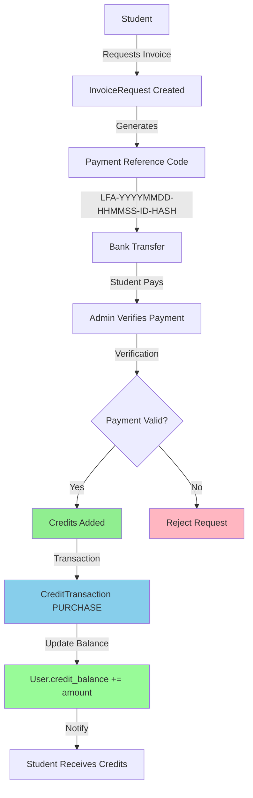
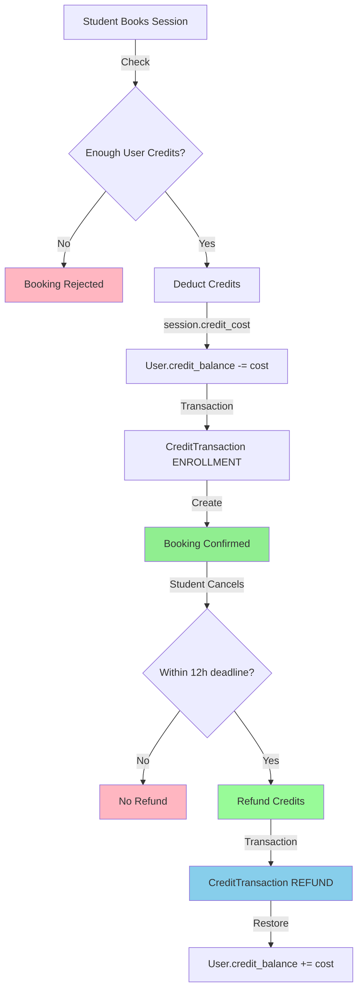
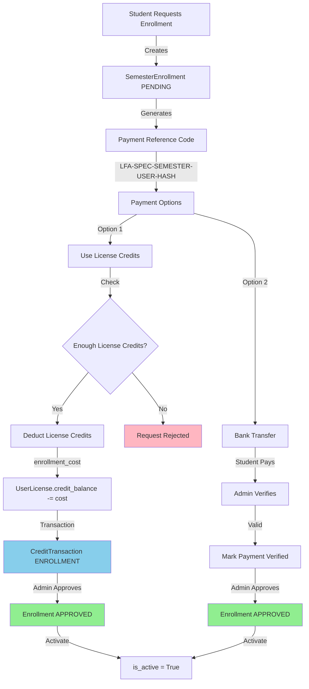
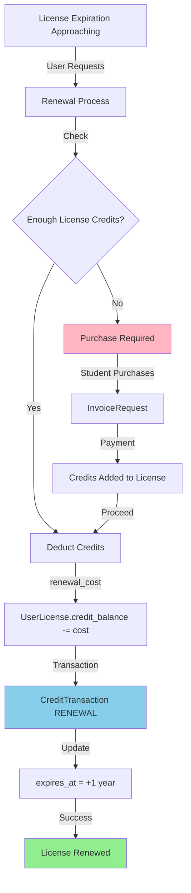

# 💰 CREDIT SYSTEM - TELJES FLOW DOKUMENTÁCIÓ

**Dátum**: 2025-12-17
**Verzió**: 1.0
**Státusz**: ✅ COMPLETE

---

## 📊 EXECUTIVE SUMMARY

Az LFA Education Center rendszer **dual credit system**-et használ:

1. **User-level credits** (`User.credit_balance`) - Centralizált credit balance
2. **License-level credits** (`UserLicense.credit_balance`) - Per-license credit balance

**Fő használati módok**:
- Session booking → User credit balance
- Semester enrollment → UserLicense credit balance
- License renewal → UserLicense credit balance

---

## 🏗️ CREDIT SYSTEM ARCHITECTURE

### Dual Credit System

```
┌─────────────────────────────────────────────────────────────┐
│                    CREDIT SYSTEM                             │
├─────────────────────────────────────────────────────────────┤
│                                                              │
│  ┌──────────────────────┐      ┌─────────────────────────┐ │
│  │   USER-LEVEL         │      │   LICENSE-LEVEL         │ │
│  │   (Centralized)      │      │   (Per-Specialization)  │ │
│  ├──────────────────────┤      ├─────────────────────────┤ │
│  │                      │      │                         │ │
│  │ User.credit_balance  │      │ UserLicense.            │ │
│  │ User.credit_purchased│      │   credit_balance        │ │
│  │                      │      │ UserLicense.            │ │
│  │ Used for:            │      │   credit_purchased      │ │
│  │ - Session bookings   │      │                         │ │
│  │ - General activities │      │ Used for:               │ │
│  │                      │      │ - Semester enrollment   │ │
│  │                      │      │ - License renewal       │ │
│  │                      │      │ - Specialization items  │ │
│  └──────────────────────┘      └─────────────────────────┘ │
│                                                              │
│  Both tracked by:                                           │
│  └──> CreditTransaction (full audit trail)                  │
│                                                              │
└─────────────────────────────────────────────────────────────┘
```

---

## 🔄 CREDIT FLOW DIAGRAMS

### 1. Credit Purchase Flow



### 2. Session Booking Flow (User Credits)



### 3. Semester Enrollment Flow (License Credits)



### 4. License Renewal Flow



---

## 💳 CREDIT PRICING TABLE

| Item | Credit Cost | EUR Value | Notes |
|------|-------------|-----------|-------|
| **Credit Packages** |
| Small Package | 500 credits | 500 EUR | 1:1 ratio |
| Medium Package | 1000 credits | 1000 EUR | 1:1 ratio |
| Large Package | 2000 credits | 2000 EUR | 1:1 ratio |
| **Session Booking** |
| Standard Session | 1 credit | ~1 EUR | Per session |
| **Semester Enrollment** |
| Semester Enrollment | 500 credits | 500 EUR | Per specialization |
| **License Renewal** |
| Annual Renewal | 1000 credits | 1000 EUR | Per license/year |

---

## 📋 CREDIT TRANSACTION TYPES

### Transaction Types Enum

```python
class TransactionType(enum.Enum):
    PURCHASE = "PURCHASE"           # User purchased credits
    ENROLLMENT = "ENROLLMENT"       # Credits deducted for enrollment
    REFUND = "REFUND"              # Credits refunded (cancellation)
    ADMIN_ADJUSTMENT = "ADMIN_ADJUSTMENT"  # Manual admin adjustment
    EXPIRATION = "EXPIRATION"      # Credits expired (2 year limit)
```

### Transaction Model

```python
class CreditTransaction(Base):
    id = Column(Integer, primary_key=True)
    user_license_id = Column(Integer, ForeignKey("user_licenses.id"))

    # Transaction details
    transaction_type = Column(String(50), nullable=False)
    amount = Column(Integer, nullable=False)  # +1000 or -250
    balance_after = Column(Integer, nullable=False)  # Snapshot
    description = Column(Text, nullable=True)

    # Related entities
    semester_id = Column(Integer, ForeignKey("semesters.id"))
    enrollment_id = Column(Integer, ForeignKey("semester_enrollments.id"))

    created_at = Column(DateTime, nullable=False)
```

---

## 🔐 CREDIT VALIDATION RULES

### 1. Purchase Validation

```python
def validate_credit_purchase(amount: int, user: User) -> bool:
    """Validate credit purchase request"""
    # Valid amounts: 500, 1000, 2000 credits
    if amount not in [500, 1000, 2000]:
        raise ValueError("Invalid credit amount")

    # User must have NDA accepted
    if not user.nda_accepted:
        raise ValueError("NDA acceptance required")

    # Invoice request created
    invoice = InvoiceRequest.create(user, amount)

    return True
```

### 2. Enrollment Validation

```python
def validate_semester_enrollment(
    user: User,
    semester: Semester,
    user_license: UserLicense
) -> bool:
    """Validate semester enrollment credit check"""

    # Check license credit balance
    if user_license.credit_balance < semester.enrollment_cost:
        raise ValueError(
            f"Insufficient credits. "
            f"Required: {semester.enrollment_cost}, "
            f"Available: {user_license.credit_balance}"
        )

    # Check license is active
    if not user_license.is_active:
        raise ValueError("License is not active")

    return True
```

### 3. Session Booking Validation

```python
def validate_session_booking(user: User, session: Session) -> bool:
    """Validate session booking credit check"""

    # Check user credit balance
    if user.credit_balance < session.credit_cost:
        raise ValueError(
            f"Insufficient credits. "
            f"Required: {session.credit_cost}, "
            f"Available: {user.credit_balance}"
        )

    return True
```

---

## 📊 CREDIT TRANSACTION AUDIT TRAIL

### Example Transaction History

```sql
-- User purchases 1000 credits
INSERT INTO credit_transactions (
    user_license_id, transaction_type, amount, balance_after, description
) VALUES (
    42, 'PURCHASE', 1000, 1000,
    'Credit purchase via invoice LFA-20251217-143000-00042-A3F2'
);

-- Student enrolls in semester (500 credits)
INSERT INTO credit_transactions (
    user_license_id, transaction_type, amount, balance_after,
    description, semester_id, enrollment_id
) VALUES (
    42, 'ENROLLMENT', -500, 500,
    'Semester enrollment: Spring 2025 INTERNSHIP',
    15, 238
);

-- Admin adjustment (+100 bonus credits)
INSERT INTO credit_transactions (
    user_license_id, transaction_type, amount, balance_after, description
) VALUES (
    42, 'ADMIN_ADJUSTMENT', 100, 600,
    'Bonus credits for referral program'
);
```

### Query Transaction History

```python
def get_credit_history(user_license_id: int) -> List[CreditTransaction]:
    """Get full credit transaction history"""
    return (
        db.query(CreditTransaction)
        .filter(CreditTransaction.user_license_id == user_license_id)
        .order_by(CreditTransaction.created_at.desc())
        .all()
    )
```

---

## 🎯 COMMON SCENARIOS

### Scenario 1: New Student Onboarding

```
1. Student signs up → User created
2. Student selects INTERNSHIP specialization
3. Student completes onboarding → UserLicense created
   - credit_balance = 0
   - credit_purchased = 0
4. Student requests invoice for 1000 credits
5. InvoiceRequest created with payment_reference
6. Student pays via bank transfer
7. Admin verifies payment
8. CreditTransaction PURCHASE created (+1000)
9. UserLicense.credit_balance = 1000
10. Student enrolls in semester (500 credits)
11. CreditTransaction ENROLLMENT created (-500)
12. UserLicense.credit_balance = 500
13. SemesterEnrollment.is_active = True
```

### Scenario 2: Session Booking with Refund

```
1. Student has User.credit_balance = 10
2. Student books session (cost = 1 credit)
3. User.credit_balance = 9
4. CreditTransaction ENROLLMENT (-1)
5. Booking.status = CONFIRMED
6. Student cancels within 12h deadline
7. Refund triggered
8. User.credit_balance = 10
9. CreditTransaction REFUND (+1)
10. Booking.status = CANCELLED
```

### Scenario 3: License Renewal

```
1. UserLicense expires in 30 days
2. System sends renewal reminder
3. Student checks credit_balance = 800
4. Student needs 1000 credits for renewal
5. Student purchases 500 credits
6. CreditTransaction PURCHASE (+500)
7. UserLicense.credit_balance = 1300
8. Student initiates renewal
9. CreditTransaction RENEWAL (-1000)
10. UserLicense.credit_balance = 300
11. UserLicense.expires_at = +1 year
```

### Scenario 4: Invitation Code Bonus

```
1. Admin creates InvitationCode
   - code = "INV-20251217-A3F2E8"
   - bonus_credits = 200
   - invited_email = "newstudent@example.com"
2. New student signs up with email
3. Student enters invitation code
4. System validates code (unused, not expired, email matches)
5. CreditTransaction ADMIN_ADJUSTMENT (+200)
6. User.credit_balance = 200
7. InvitationCode.is_used = True
8. InvitationCode.used_by_user_id = student.id
```

---

## 🚨 ERROR HANDLING

### Common Errors

| Error | Cause | Solution |
|-------|-------|----------|
| `InsufficientCreditsError` | User/License balance too low | Purchase more credits |
| `InvalidAmountError` | Credit amount not 500/1000/2000 | Use standard packages |
| `PaymentNotVerifiedError` | Admin hasn't verified payment | Wait for admin verification |
| `LicenseInactiveError` | License not active | Renew license |
| `EnrollmentNotApprovedError` | Admin hasn't approved enrollment | Wait for admin approval |

### Error Handling Example

```python
from fastapi import HTTPException

def deduct_credits(user: User, amount: int) -> None:
    """Deduct credits with validation"""
    if user.credit_balance < amount:
        raise HTTPException(
            status_code=400,
            detail={
                "error": "InsufficientCredits",
                "message": f"Insufficient credits. Required: {amount}, Available: {user.credit_balance}",
                "required": amount,
                "available": user.credit_balance,
                "shortfall": amount - user.credit_balance
            }
        )

    # Deduct credits
    user.credit_balance -= amount

    # Create audit transaction
    CreditTransaction.create(
        user_license_id=user.current_license.id,
        transaction_type="ENROLLMENT",
        amount=-amount,
        balance_after=user.credit_balance
    )
```

---

## 🔍 CREDIT BALANCE QUERIES

### Check User Balance

```python
def get_user_credit_summary(user_id: int) -> dict:
    """Get complete credit summary for user"""
    user = db.query(User).filter(User.id == user_id).first()

    return {
        "user_credits": {
            "balance": user.credit_balance,
            "purchased": user.credit_purchased,
            "used_for": "Session bookings, general activities"
        },
        "license_credits": [
            {
                "specialization": license.specialization_type,
                "balance": license.credit_balance,
                "purchased": license.credit_purchased,
                "expires_at": license.expires_at,
                "used_for": "Semester enrollment, license renewal"
            }
            for license in user.user_licenses
        ]
    }
```

### Get Transaction History

```python
def get_transaction_history(
    user_license_id: int,
    limit: int = 50,
    transaction_type: Optional[str] = None
) -> List[dict]:
    """Get paginated transaction history"""
    query = db.query(CreditTransaction).filter(
        CreditTransaction.user_license_id == user_license_id
    )

    if transaction_type:
        query = query.filter(
            CreditTransaction.transaction_type == transaction_type
        )

    transactions = (
        query
        .order_by(CreditTransaction.created_at.desc())
        .limit(limit)
        .all()
    )

    return [tx.to_dict() for tx in transactions]
```

---

## 📈 CREDIT ANALYTICS

### Monthly Credit Flow

```python
def get_monthly_credit_flow(month: int, year: int) -> dict:
    """Get credit flow statistics for a month"""

    start_date = datetime(year, month, 1)
    end_date = start_date + relativedelta(months=1)

    transactions = db.query(CreditTransaction).filter(
        CreditTransaction.created_at >= start_date,
        CreditTransaction.created_at < end_date
    ).all()

    return {
        "total_purchased": sum(
            tx.amount for tx in transactions
            if tx.transaction_type == "PURCHASE"
        ),
        "total_spent": sum(
            abs(tx.amount) for tx in transactions
            if tx.transaction_type == "ENROLLMENT"
        ),
        "total_refunded": sum(
            tx.amount for tx in transactions
            if tx.transaction_type == "REFUND"
        ),
        "net_flow": sum(tx.amount for tx in transactions)
    }
```

---

## ✅ BEST PRACTICES

### 1. Always Create Audit Transactions

```python
# ✅ GOOD - Creates audit trail
def purchase_credits(user_license: UserLicense, amount: int):
    user_license.credit_balance += amount
    user_license.credit_purchased += amount

    CreditTransaction.create(
        user_license_id=user_license.id,
        transaction_type="PURCHASE",
        amount=amount,
        balance_after=user_license.credit_balance
    )

    db.commit()

# ❌ BAD - No audit trail
def purchase_credits_bad(user_license: UserLicense, amount: int):
    user_license.credit_balance += amount
    db.commit()  # Missing audit transaction!
```

### 2. Validate Before Deducting

```python
# ✅ GOOD - Validates first
def enroll_in_semester(user_license: UserLicense, semester: Semester):
    if user_license.credit_balance < semester.enrollment_cost:
        raise InsufficientCreditsError()

    # Deduct credits
    user_license.credit_balance -= semester.enrollment_cost
    # ... rest of enrollment logic

# ❌ BAD - Deducts without validation
def enroll_bad(user_license: UserLicense, semester: Semester):
    user_license.credit_balance -= semester.enrollment_cost  # Could go negative!
```

### 3. Use Transactions for Atomicity

```python
# ✅ GOOD - Atomic transaction
from sqlalchemy.orm import Session

def process_enrollment(
    db: Session,
    user_license: UserLicense,
    semester: Semester
):
    try:
        # Validate
        validate_credits(user_license, semester.enrollment_cost)

        # Deduct credits
        user_license.credit_balance -= semester.enrollment_cost

        # Create audit
        credit_tx = CreditTransaction(...)
        db.add(credit_tx)

        # Create enrollment
        enrollment = SemesterEnrollment(...)
        db.add(enrollment)

        # Commit all or nothing
        db.commit()
    except Exception as e:
        db.rollback()
        raise
```

---

## 📞 API ENDPOINTS

### Credit Management Endpoints

```
GET    /api/v1/credits/balance              # Get user credit balance
GET    /api/v1/credits/transactions         # Get transaction history
POST   /api/v1/credits/purchase             # Request credit purchase
POST   /api/v1/credits/redeem-invitation    # Redeem invitation code

# Admin endpoints
POST   /api/v1/admin/credits/verify-payment # Verify payment
POST   /api/v1/admin/credits/adjust         # Manual adjustment
GET    /api/v1/admin/credits/analytics      # Credit analytics
```

---

## 🎯 SUMMARY

### Credit System Key Points

1. ✅ **Dual Credit System** - User-level + License-level
2. ✅ **Full Audit Trail** - Every transaction logged
3. ✅ **Atomic Operations** - Credits + Transaction in same DB transaction
4. ✅ **Validation** - Always check balance before deducting
5. ✅ **Refund Support** - Cancellations within deadline refund credits
6. ✅ **Admin Controls** - Manual adjustments with audit trail
7. ✅ **Payment Verification** - Bank transfer with unique reference codes
8. ✅ **Expiration Tracking** - 2-year credit expiration (optional)

### When to Use Which Credits

| Use Case | Credit Source | Balance Field |
|----------|---------------|---------------|
| Session Booking | User Credits | `User.credit_balance` |
| Semester Enrollment | License Credits | `UserLicense.credit_balance` |
| License Renewal | License Credits | `UserLicense.credit_balance` |
| General Activities | User Credits | `User.credit_balance` |

---

**Dokumentum Készítő**: Claude Code AI
**Dátum**: 2025-12-17
**Státusz**: ✅ **COMPLETE**

---

## 📚 RELATED DOCUMENTATION

- [Database Audit](DATABASE_STRUCTURE_AUDIT_COMPLETE.md) - Credit system database structure
- [Session Rules](SESSION_RULES_ETALON.md) - Session booking rules
- [Backend Implementation](SESSION_RULES_BACKEND_IMPLEMENTATION_COMPLETE.md) - Code details

---

**END OF CREDIT SYSTEM FLOW DOCUMENTATION**
