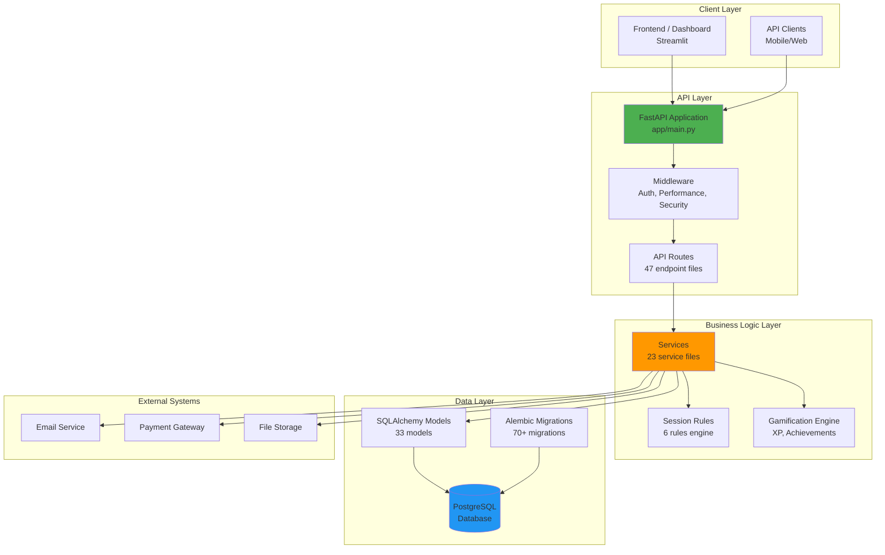
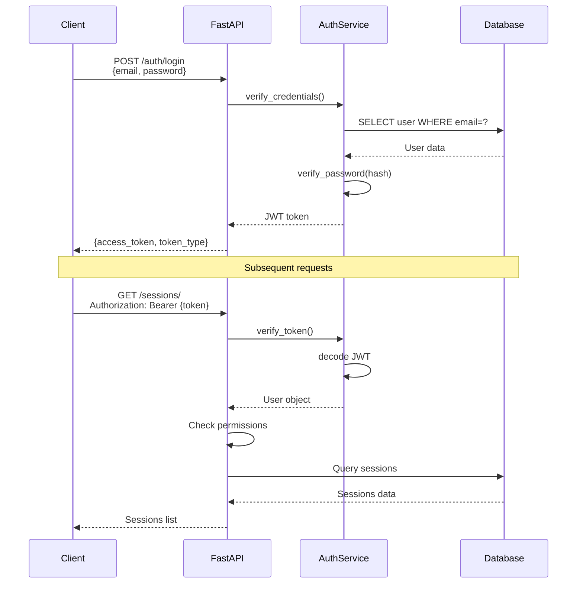
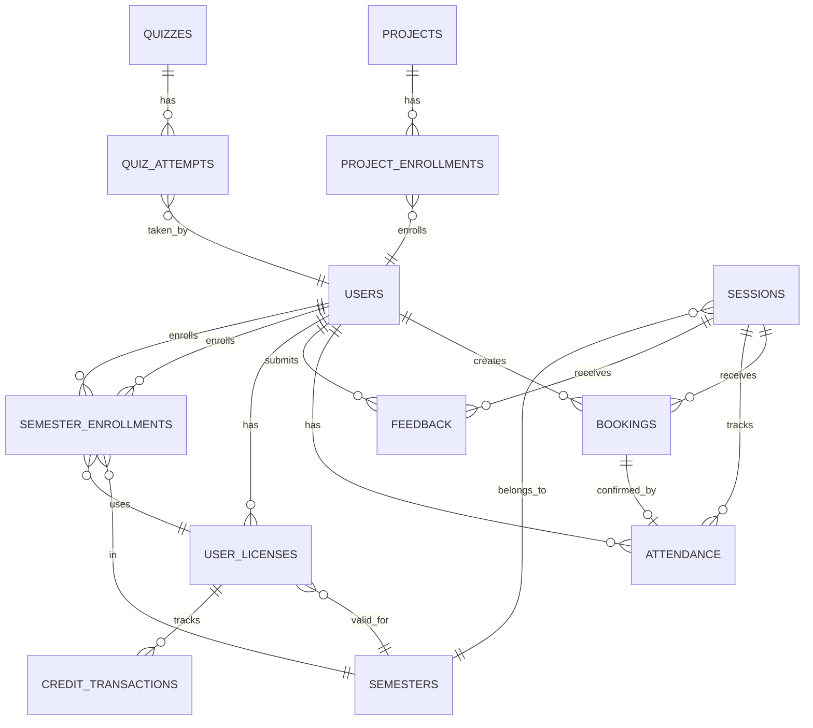

# 🏗️ SYSTEM ARCHITECTURE - LFA Practice Booking System

**Dátum**: 2025-12-17
**Verzió**: 2.1
**Státusz**: Production Ready

---

## 🎯 ÁTTEKINTÉS

Az LFA Education Center Practice Booking System egy komplex, multi-tenant rendszer amely kezeli:
- Session management (ONSITE/HYBRID/VIRTUAL)
- Booking és waitlist kezelés
- Attendance tracking (two-way confirmation)
- License management (8 LFA Player levels, 8 LFA Coach levels, 3 Internship levels)
- Gamification (XP, achievements, belt system)
- Credit-based payment system
- Semester-based enrollments
- Instructor assignment system

---

## 📐 HIGH-LEVEL ARCHITECTURE



---

## 🔧 TECHNOLOGY STACK

### Backend
- **Framework**: FastAPI 0.104+
- **Language**: Python 3.9+
- **ORM**: SQLAlchemy 2.0+
- **Migrations**: Alembic
- **Authentication**: JWT (JSON Web Tokens)
- **Validation**: Pydantic 2.0+

### Database
- **RDBMS**: PostgreSQL 14+
- **Connection Pool**: SQLAlchemy Engine
- **Query Monitoring**: Custom middleware (slow query detection)

### Testing
- **Framework**: Pytest
- **Coverage**: pytest-cov
- **Test Count**: 163 tests across 17 files

### Monitoring
- **Logging**: Python logging module
- **Performance**: Custom query logger
- **Slow Query Detection**: Automatic N+1 pattern detection

---

## 📊 LAYER-BY-LAYER BREAKDOWN

### 1. API Layer (FastAPI)

```
app/
├── main.py                 # FastAPI application entry point
├── api/
│   ├── api_v1/
│   │   ├── api.py          # API router aggregation
│   │   └── endpoints/      # 47 endpoint files
│   │       ├── auth.py
│   │       ├── users.py
│   │       ├── sessions.py
│   │       ├── bookings.py
│   │       ├── attendance.py
│   │       ├── feedback.py
│   │       ├── licenses.py
│   │       ├── projects.py
│   │       ├── semesters.py
│   │       └── ... (38 more)
│   └── deps.py             # Dependency injection
└── middleware/
    ├── auth.py             # JWT authentication
    ├── security.py         # Rate limiting, CORS
    ├── query_logger.py     # Query monitoring
    └── performance_middleware.py  # Performance tracking
```

**Key Features**:
- ✅ RESTful API design
- ✅ JWT-based authentication
- ✅ Role-based access control (ADMIN/INSTRUCTOR/STUDENT)
- ✅ Automatic request validation (Pydantic)
- ✅ OpenAPI/Swagger documentation
- ✅ Performance monitoring (query count, duration)

---

### 2. Service Layer

```
app/services/
├── gamification.py                # XP, achievements, levels
├── session_filter_service.py      # Session filtering + caching
├── license_service.py             # License management
├── license_authorization_service.py  # License authorization
├── license_renewal_service.py     # License renewal
├── audit_service.py               # Audit logging
├── quiz_service.py                # Quiz logic
├── specialization_service.py      # Specialization handling
├── football_skill_service.py      # Skill assessments
└── ... (14 more services)
```

**Service Responsibilities**:
- Business logic encapsulation
- Data validation beyond schema
- Complex calculations (XP, credits)
- External API integration
- Audit trail generation

**Example Service Pattern**:
```python
# app/services/gamification.py
def award_xp(db: Session, user_id: int, session: Session) -> int:
    """
    Calculate and award XP based on Session Rule #6.

    XP = Base(50) + Instructor Bonus(0-50) + Quiz Bonus(0-150)
    Max: 250 XP
    """
    base_xp = 50
    instructor_bonus = calculate_instructor_bonus(session)
    quiz_bonus = calculate_quiz_bonus(db, user_id, session)

    total_xp = min(base_xp + instructor_bonus + quiz_bonus, 250)

    # Update user XP
    user = db.query(User).filter(User.id == user_id).first()
    user.xp += total_xp
    db.commit()

    return total_xp
```

---

### 3. Data Layer (Models)

```
app/models/
├── user.py                 # User (479 lines) - Central model
├── session.py              # Session (178 lines) - Core business
├── booking.py              # Booking (76 lines) - Reservation
├── attendance.py           # Attendance (75 lines) - Check-in
├── feedback.py             # Feedback (32 lines) - Ratings
├── license.py              # UserLicense (341 lines) - License progression
├── semester.py             # Semester (84 lines) - Academic periods
├── semester_enrollment.py  # SemesterEnrollment (258 lines) - Multi-spec
├── project.py              # Project (256 lines) - Project-based learning
├── quiz.py                 # Quiz (217 lines) - Adaptive quizzes
├── credit_transaction.py   # CreditTransaction - Financial audit
├── instructor_assignment.py  # InstructorAssignment - Demand-driven
├── belt_promotion.py       # BeltPromotion - Gancuju belt system
└── ... (20 more models)
```

**Model Statistics**:
- **Total Models**: 33
- **Total Relationships**: 80+ foreign keys
- **Total Enums**: 25+ (type safety)
- **Total Indexes**: 74+ (performance)
- **Total Migrations**: 70+

**Key Patterns**:
- Enum-based type safety
- Audit timestamps (created_at, updated_at)
- Soft delete (is_active flags)
- Hybrid properties (computed values)
- Relationship lazy/eager loading

---

### 4. Schema Layer (Pydantic)

```
app/schemas/
├── user.py
├── session.py
├── booking.py
├── attendance.py
├── feedback.py
├── license.py
├── semester.py
└── ... (17 more schemas)
```

**Schema Types**:
- **Base**: Shared fields
- **Create**: Input validation for POST
- **Update**: Input validation for PUT/PATCH
- **InDB**: Database representation
- **Response**: API response format

**Example Schema**:
```python
# app/schemas/booking.py
class BookingBase(BaseModel):
    session_id: int

class BookingCreate(BookingBase):
    pass

class BookingUpdate(BaseModel):
    status: Optional[BookingStatus] = None

class BookingInDB(BookingBase):
    id: int
    user_id: int
    status: BookingStatus
    created_at: datetime

    class Config:
        from_attributes = True

class BookingResponse(BookingInDB):
    session: SessionResponse
    user: UserResponse
```

---

## 🔐 AUTHENTICATION & AUTHORIZATION

### Authentication Flow



### Role-Based Access Control

| Role | Permissions |
|------|------------|
| **ADMIN** | Full system access, user management, session management, reports |
| **INSTRUCTOR** | View students, manage own sessions, mark attendance, view analytics |
| **STUDENT** | Book sessions, check-in, submit feedback, view own progress |

**Implementation**:
```python
# app/api/deps.py
def require_role(allowed_roles: List[UserRole]):
    def role_checker(current_user: User = Depends(get_current_user)):
        if current_user.role not in allowed_roles:
            raise HTTPException(status_code=403, detail="Insufficient permissions")
        return current_user
    return role_checker

# Usage in endpoint
@router.get("/admin/users")
def list_users(
    current_user: User = Depends(require_role([UserRole.ADMIN]))
):
    # Only admins can access
```

---

## 💾 DATABASE ARCHITECTURE

### Database Schema Overview



### Key Tables

| Table | Purpose | Key Fields | Relationships |
|-------|---------|------------|---------------|
| **users** | User accounts | id, email, role, specialization | → bookings, attendance, licenses |
| **sessions** | Training sessions | id, type, start_time, end_time | ← bookings, attendance, feedback |
| **bookings** | Session reservations | id, user_id, session_id, status | → attendance |
| **attendance** | Check-in records | id, booking_id, status, check_in_time | → sessions, users |
| **user_licenses** | License progression | id, user_id, level, credits, expiration | → credit_transactions |
| **semesters** | Academic periods | id, name, start_date, end_date, status | → sessions, enrollments |
| **credit_transactions** | Financial audit trail | id, user_license_id, amount, type | ← user_licenses |

### Database Quality Metrics

- **Overall Quality**: 90.75% (A-)
- **Data Integrity**: 95% (enums, constraints, indexes)
- **Performance**: 85% (74+ indexes, 4 added in audit)
- **Security**: 90% (role-based access, audit logging)

---

## 🎮 GAMIFICATION SYSTEM

### XP Calculation (Session Rule #6)

```
XP = Base(50) + Instructor Bonus(0-50) + Quiz Bonus(0-150)
Max: 250 XP per session
```

### Levels & Progression

**LFA Player** (8 levels):
1. Prospect (0-999 XP)
2. Rookie (1000-2999 XP)
3. Rising Star (3000-5999 XP)
4. Pro (6000-9999 XP)
5. All-Star (10000-14999 XP)
6. Elite (15000-20999 XP)
7. Legend (21000-27999 XP)
8. Icon (28000+ XP)

**LFA Coach** (8 levels):
1. Assistant Coach (0-999 XP)
2. Junior Coach (1000-2999 XP)
3. Coach (3000-5999 XP)
4. Senior Coach (6000-9999 XP)
5. Head Coach (10000-14999 XP)
6. Master Coach (15000-20999 XP)
7. Elite Coach (21000-27999 XP)
8. Legendary Coach (28000+ XP)

**Internship** (3 levels):
1. Junior Intern (0-4999 XP)
2. Senior Intern (5000-14999 XP)
3. Lead Intern (15000+ XP)

### GānCuju™️ Belt System

7 belts for LFA Player specialization:
1. White Belt
2. Yellow Belt
3. Orange Belt
4. Green Belt
5. Blue Belt
6. Red Belt
7. Black Belt

**Belt Promotion Criteria**:
- Technical skill assessment (5 defending skills)
- XP threshold reached
- Instructor recommendation

---

## 💰 CREDIT SYSTEM

### Dual Credit Architecture

```
┌─────────────────────────────────────────────────────────────┐
│  ┌──────────────────────┐      ┌─────────────────────────┐ │
│  │   USER-LEVEL         │      │   LICENSE-LEVEL         │ │
│  │   (Centralized)      │      │   (Per-Specialization)  │ │
│  │                      │      │                         │ │
│  │ Used for:            │      │ Used for:               │ │
│  │ - Session bookings   │      │ - Semester enrollment   │ │
│  │ - General activities │      │ - License renewal       │ │
│  └──────────────────────┘      └─────────────────────────┘ │
└─────────────────────────────────────────────────────────────┘
```

**Credit Transaction Types**:
- PURCHASE - Buy credits
- DEDUCTION - Booking session
- REFUND - Cancellation before 12h deadline
- ENROLLMENT - Semester enrollment cost
- ADMIN_ADJUSTMENT - Manual correction
- EXPIRATION - License expiration

**Full Documentation**: [docs/CURRENT/CREDIT_SYSTEM_FLOW_COMPLETE.md](docs/CURRENT/CREDIT_SYSTEM_FLOW_COMPLETE.md)

---

## 📅 SESSION RULES ENGINE

### 6 Validated Rules

| Rule | Name | Implementation | Status |
|------|------|----------------|--------|
| #1 | 24h Booking Deadline | [bookings.py:146](app/api/api_v1/endpoints/bookings.py#L146) | ✅ |
| #2 | 12h Cancellation Deadline | [bookings.py:338](app/api/api_v1/endpoints/bookings.py#L338) | ✅ |
| #3 | 15min Check-in Window | [attendance.py:150](app/api/api_v1/endpoints/attendance.py#L150) | ✅ |
| #4 | 24h Feedback Window | [feedback.py:82](app/api/api_v1/endpoints/feedback.py#L82) | ✅ |
| #5 | Session-Type Quiz | quiz.py endpoints | ✅ |
| #6 | Intelligent XP | gamification.py | ✅ |

**Full Documentation**: [docs/CURRENT/SESSION_RULES_ETALON.md](docs/CURRENT/SESSION_RULES_ETALON.md)

---

## 📊 PERFORMANCE MONITORING

### Query Monitoring

**Middleware Stack**:
```
Request → PerformanceMonitoringMiddleware
         → QueryMonitor (SQLAlchemy events)
         → Log slow queries (>100ms)
         → Detect N+1 patterns (>10 similar queries)
         → Add performance headers
         → Response
```

**Performance Headers**:
- `X-Request-Duration-Ms`: Total request time
- `X-Query-Count`: Number of DB queries
- `X-Query-Time-Ms`: Total DB time

**Full Documentation**: [docs/CURRENT/SLOW_QUERY_MONITORING_GUIDE.md](docs/CURRENT/SLOW_QUERY_MONITORING_GUIDE.md)

---

## 🧪 TESTING ARCHITECTURE

### Test Pyramid

```
           /\
          /E2E\          4 tests (workflow tests)
         /------\
        /Integration\    42 tests (API endpoint tests)
       /--------------\
      /   Unit Tests   \  117 tests (service/model tests)
     /------------------\
```

**Test Statistics**:
- Total Tests: 163
- Test Files: 17
- Test Coverage: ~25-30% (⚠️ Needs improvement)

**Infrastructure**:
- Pytest fixtures for DB isolation
- Role-based user fixtures (admin, instructor, student)
- JWT token fixtures
- Transaction rollback after each test

**Full Documentation**: [docs/CURRENT/TESTING_COVERAGE_AUDIT_COMPLETE.md](docs/CURRENT/TESTING_COVERAGE_AUDIT_COMPLETE.md)

---

## 📞 RELATED DOCUMENTATION

- **API Endpoint Audit**: [docs/CURRENT/API_ENDPOINT_AUDIT_COMPLETE.md](docs/CURRENT/API_ENDPOINT_AUDIT_COMPLETE.md)
- **Database Structure Audit**: [docs/CURRENT/DATABASE_STRUCTURE_AUDIT_COMPLETE.md](docs/CURRENT/DATABASE_STRUCTURE_AUDIT_COMPLETE.md)
- **Testing Coverage Audit**: [docs/CURRENT/TESTING_COVERAGE_AUDIT_COMPLETE.md](docs/CURRENT/TESTING_COVERAGE_AUDIT_COMPLETE.md)
- **Credit System Flow**: [docs/CURRENT/CREDIT_SYSTEM_FLOW_COMPLETE.md](docs/CURRENT/CREDIT_SYSTEM_FLOW_COMPLETE.md)
- **Session Rules**: [docs/CURRENT/SESSION_RULES_ETALON.md](docs/CURRENT/SESSION_RULES_ETALON.md)
- **Slow Query Monitoring**: [docs/CURRENT/SLOW_QUERY_MONITORING_GUIDE.md](docs/CURRENT/SLOW_QUERY_MONITORING_GUIDE.md)

---

**Document Készítő**: Claude Sonnet 4.5
**Dátum**: 2025-12-17
**Verzió**: 1.0

---

**END OF SYSTEM ARCHITECTURE**
