# Release Gate Policy — Lifecycle Suite as Production Quality Gate

> **Policy Type**: MANDATORY (BLOCKING)
> **Effective Date**: 2026-02-23
> **Enforcement**: Automated (GitHub Actions)
> **Exceptions**: NONE (no bypass allowed)

---

## 1. Policy Statement

**All production releases MUST pass the Lifecycle Suite with 100% GREEN status before deployment.**

The **Lifecycle Suite** is the final quality gate for all code changes. It validates all revenue-critical and business-critical workflows end-to-end with zero tolerance for flake.

### What is the Lifecycle Suite?

The Lifecycle Suite consists of **11 BLOCKING gates** in CI:

| Gate | Purpose | Tests | Runtime |
|------|---------|-------|---------|
| `unit-tests` | Code correctness + isolation | ~100 tests | ~2 min |
| `cascade-isolation-guard` | Cascade delete validation | 1 test | ~30s |
| `api-module-integrity` | Import + route registry | N/A (lint) | ~10s |
| `hardcoded-id-guard` | Test isolation enforcement | N/A (lint) | ~5s |
| `smoke-tests` | Critical user flows (E2E) | ~5 tests | ~1 min |
| **`payment-workflow-gate`** | Payment E2E (BLOCKING) | 3 tests | ~5s |
| **`core-access-gate`** | Core access E2E (BLOCKING) | 2 tests | ~1 min |
| **`student-lifecycle-gate`** | Student E2E (BLOCKING) | 2 tests | ~2 min |
| **`instructor-lifecycle-gate`** | Instructor E2E (BLOCKING) | 1 test | ~2 min |
| **`refund-workflow-gate`** | Refund E2E (BLOCKING) | 1 test | ~1.5 min |
| **`multi-campus-gate`** | Multi-campus E2E (BLOCKING) | 1 test | ~2 min |

**Total CI runtime**: ~10-12 minutes per run

### Scope of Enforcement

This policy applies to:
- ✅ All pull requests to `main` branch
- ✅ All direct commits to `main` (if allowed)
- ✅ All production deployments (release candidates)
- ✅ All hotfix branches

This policy does **NOT** apply to:
- ❌ Feature branches (pre-PR development)
- ❌ Local development (developer discretion)
- ❌ Experimental branches (marked `experimental/`)

---

## 2. Release Criteria

### Mandatory Requirements

Before any production deployment, ALL of the following must be true:

1. **CI Status**: All 11 gates show ✅ PASS
2. **Flake Status**: 0 intermittent failures in last 10 CI runs
3. **Runtime Status**: All tests within threshold + 20% (no regression)
4. **Coverage Status**: No skipped tests in Integration Critical suite
5. **Baseline Report**: GitHub Actions summary shows "Safe to merge ✅"

### Failure Modes (and Actions)

| Failure | Meaning | Action | Bypass Allowed? |
|---------|---------|--------|-----------------|
| Unit test fails | Code regression | Fix bug, re-run CI | ❌ NO |
| E2E test fails | Business logic broken | Fix regression, re-run CI | ❌ NO |
| Test flakes | Intermittent failure | Investigate root cause, fix flake | ❌ NO |
| Runtime regression | Performance degradation | Optimize slow code, re-run CI | ❌ NO |
| Infrastructure failure | CI environment issue | Fix infrastructure, re-run CI | ✅ YES (with approval) |

**Infrastructure bypass**: Only allowed if CI environment is provably broken (DB down, network timeout, etc.) AND test passes locally with 20x validation.

---

## 3. Deployment Flow

### Standard Release Process

```mermaid
graph TD
    A[Feature Development] --> B[Create PR to main]
    B --> C[CI Runs 11 Gates]
    C --> D{All Gates GREEN?}
    D -->|NO| E[❌ Fix Issues]
    E --> C
    D -->|YES| F[Code Review]
    F --> G{Approved?}
    G -->|NO| E
    G -->|YES| H[Merge to main]
    H --> I[Main Branch CI Validation]
    I --> J{Baseline GREEN?}
    J -->|NO| K[❌ Block Release - Revert or Fix]
    J -->|YES| L[Create Release Candidate]
    L --> M[Deploy to Staging]
    M --> N[Manual QA Sign-off]
    N --> O[🚀 Deploy to Production]
    O --> P[Post-Deploy Health Check]
    P --> Q{Health Check PASS?}
    Q -->|NO| R[🔄 Rollback]
    Q -->|YES| S[✅ Release Complete]
```



### Emergency Hotfix Process

For critical production bugs:

1. **Create hotfix branch** from `main` (not from feature branch)
2. **Implement fix** with minimal changes
3. **Run CI** — all 11 gates must pass (NO exceptions)
4. **Expedited review** (30 min SLA)
5. **Merge to main** — baseline validation
6. **Deploy immediately** — skip staging if approved by team lead
7. **Post-deploy monitoring** — first 30 minutes critical

**Even hotfixes MUST pass all gates.** No bypass allowed.

---

## 4. Enforcement Mechanism

### GitHub Branch Protection Rules

Settings for `main` branch:

```yaml
Branch: main
Protection Rules:
  - Require status checks to pass before merging: ✅ ENABLED
  - Required status checks:
      - unit-tests
      - cascade-isolation-guard
      - api-module-integrity
      - hardcoded-id-guard
      - smoke-tests
      - payment-workflow-gate
      - core-access-gate
      - student-lifecycle-gate
      - instructor-lifecycle-gate
      - refund-workflow-gate
      - multi-campus-gate
      - baseline-report
  - Require branches to be up to date: ✅ ENABLED
  - Require conversation resolution: ✅ ENABLED
  - Do not allow bypassing: ✅ ENABLED (even for admins)
  - Restrict who can push to matching branches: ✅ ENABLED
  - Allow force pushes: ❌ DISABLED
  - Allow deletions: ❌ DISABLED
```

### Automated Enforcement

GitHub Actions automatically:
- Runs all 11 gates on every PR
- Blocks merge if ANY gate fails
- Updates PR status check (✅ PASS / ❌ FAIL)
- Generates baseline report (visible in GitHub Actions summary)
- Sends notifications on failure (Slack, email, etc.)

### Manual Review Requirement

In addition to automated gates:
- **Code review**: At least 1 approval from team member
- **QA sign-off**: Manual testing for major releases (optional)
- **Security review**: For changes touching auth, payments, or PII (required)

---

## 5. Monitoring and Alerts

### Real-Time Monitoring

CI dashboard shows:
- Current gate status (✅ PASS / ❌ FAIL / ⏳ RUNNING)
- Runtime metrics (current vs. baseline)
- Flake detection (any intermittent failures)
- Queue status (how many PRs waiting for CI)

### Alert Triggers

Automated alerts sent to team Slack channel:

| Trigger | Alert Level | Action Required |
|---------|-------------|-----------------|
| Any gate fails | 🔴 CRITICAL | Investigate immediately (within 1 hour) |
| Runtime regression >20% | 🟡 WARNING | Optimize slow tests (within 24 hours) |
| Flake detected | 🔴 CRITICAL | Fix root cause (within 4 hours) |
| CI queue >10 PRs | 🟡 WARNING | Review PR velocity (daily standup) |
| Baseline report fails | 🔴 CRITICAL | Block all merges until fixed |

### Weekly Reports

Automated weekly summary (sent Monday morning):

```markdown
## Lifecycle Suite Weekly Report (Week XX, YYYY)

### Overall Health
- Total CI runs: XX
- Success rate: XX% (target: 100%)
- Flake incidents: X (target: 0)
- Average runtime: XXs (target: <600s)

### Gate Performance
| Gate | Runs | Failures | Flake Count | Avg Runtime |
|------|------|----------|-------------|-------------|
| Unit tests | XX | X | X | XXs |
| Payment workflow | XX | X | X | XXs |
| Student lifecycle | XX | X | X | XXs |
| Instructor lifecycle | XX | X | X | XXs |
| Refund workflow | XX | X | X | XXs |
| Multi-campus | XX | X | X | XXs |

### Action Items
- [ ] Issue #XXX: [Description] [Owner] [Deadline]
- [ ] None (all gates healthy ✅)
```

---

## 6. Exception Handling

### When to Request Exception

**NEVER.** This policy has **ZERO exceptions**.

### What if CI is Down?

If GitHub Actions is down:
1. **Wait** — Do NOT bypass gates
2. **Monitor** — Check GitHub status page
3. **Coordinate** — Team lead decides if delay is acceptable
4. **Temporary workaround**: Run tests locally with 20x validation + parallel mode
   - Document results (screenshot + logs)
   - Get approval from 2 team members
   - Merge with manual override (requires admin permissions)
   - **Re-run CI immediately when GitHub recovers** — if fails, revert merge

**This workaround is ONLY for GitHub Actions outage, NOT for test failures.**

### What if a Test is Legitimately Broken?

If a test has fundamental design flaw:
1. **Create issue** with `priority:critical` label
2. **Fix root cause** (race condition, state pollution, etc.)
3. **Do NOT disable test** — keep it active while fixing
4. **If unfixable within 4 hours**: Temporarily skip test with `@pytest.mark.skip`
   - Add comment: `# TODO: Re-enable after [Issue #XXX] is fixed`
   - Set deadline: 7 days max for re-enablement
   - Track in weekly report

**Disabled tests MUST be re-enabled within 7 days or deleted permanently.**

---

## 7. Rollback Policy

### Automatic Rollback Triggers

Production deployment is **automatically rolled back** if:
- Post-deploy health check fails (HTTP 500 errors, DB connection timeout, etc.)
- Error rate >1% in first 30 minutes
- P0 incident reported (payment failures, data corruption, etc.)

### Manual Rollback Process

If production issue detected after deployment:
1. **Declare incident** (create Slack thread in `#incidents`)
2. **Assess severity**:
   - P0 (critical): Immediate rollback (no approval needed)
   - P1 (high): Rollback within 1 hour (team lead approval)
   - P2 (medium): Hotfix instead of rollback (team decision)
3. **Execute rollback**:
   - Revert to previous release candidate
   - Deploy reverted version
   - Verify health check passes
4. **Post-mortem**:
   - Why did CI not catch this issue?
   - Do we need additional E2E tests?
   - Update Lifecycle Suite to prevent recurrence

---

## 8. Governance

### Policy Owner

- **Primary**: Engineering Lead
- **Backup**: QA Lead
- **Escalation**: CTO

### Policy Review Cadence

- **Monthly**: Review metrics (runtime, flake rate, coverage)
- **Quarterly**: Full policy audit (adjust thresholds if needed)
- **Annually**: Strategic review (add/remove gates, refactor suite)

### Policy Updates

Changes to this policy require:
1. **Proposal**: Document proposed change (why, what, impact)
2. **Review**: Team discussion (pros, cons, risks)
3. **Approval**: Engineering Lead + QA Lead sign-off
4. **Communication**: Announce to team (email + Slack + wiki)
5. **Implementation**: Update documentation + CI config
6. **Validation**: Run 10 CI cycles to validate new policy

**No policy changes without team consensus.**

---

## 9. Team Responsibilities

### Developers

Responsibilities:
- ✅ Run tests locally before creating PR (`pytest -v`)
- ✅ Fix CI failures immediately (do NOT merge with failing tests)
- ✅ Add E2E tests for new critical features
- ✅ Keep PRs small (easier to debug CI failures)
- ✅ Monitor CI queue (don't create bottleneck)

### Code Reviewers

Responsibilities:
- ✅ Verify CI passed before approving PR
- ✅ Check for test coverage gaps (new code without tests)
- ✅ Validate E2E tests follow policy (isolation, performance, etc.)
- ✅ Reject PRs with skipped tests (unless justified)
- ✅ Approve only if baseline report shows "Safe to merge ✅"

### QA Team

Responsibilities:
- ✅ Monitor Lifecycle Suite health (flake rate, runtime trends)
- ✅ Investigate CI failures (root cause analysis)
- ✅ Maintain E2E test suite (optimize, refactor, document)
- ✅ Train team on testing best practices
- ✅ Weekly report on CI metrics

### Engineering Lead

Responsibilities:
- ✅ Enforce policy (no exceptions)
- ✅ Approve infrastructure bypasses (GitHub outage only)
- ✅ Review weekly CI reports
- ✅ Make policy updates (with team consensus)
- ✅ Escalate systemic issues (chronic flake, slow tests, etc.)

---

## 10. Success Metrics

### Key Performance Indicators (KPIs)

| Metric | Target | Current | Trend |
|--------|--------|---------|-------|
| **CI success rate** | 100% (first run) | TBD | Monitoring |
| **Flake rate** | 0% | TBD | Monitoring |
| **Average runtime** | <10 minutes | TBD | Monitoring |
| **Coverage** | 100% (critical workflows) | 100% ✅ | Achieved |
| **Time to merge** | <24 hours (PR created → merged) | TBD | Monitoring |

### Leading Indicators (Early Warning)

- Runtime trend: ↑ increasing → investigate slow tests
- Flake trend: Any non-zero → immediate escalation
- CI queue: >10 PRs → review PR velocity
- Disabled tests: >0 → enforce re-enablement policy

### Lagging Indicators (Post-Release)

- Production incidents: 0 that could be caught by E2E tests
- Rollbacks: 0 due to missed test coverage
- Hotfixes: <1 per month (critical bugs)

---

## 11. References

- [E2E_TESTING_POLICY.md](E2E_TESTING_POLICY.md) — Zero flake tolerance + runtime thresholds
- [LIFECYCLE_SUITE_MONITORING.md](LIFECYCLE_SUITE_MONITORING.md) — First 10 runs + metrics dashboard
- [INTEGRATION_CRITICAL_BACKLOG.md](../INTEGRATION_CRITICAL_BACKLOG.md) — Test implementation backlog
- [.github/workflows/test-baseline-check.yml](../.github/workflows/test-baseline-check.yml) — CI implementation

---

## 12. FAQ

### Q: What if I need to deploy urgently and CI is slow?

**A**: CI runtime is ~10 minutes. If that's too slow for your "urgent" deployment, the real problem is insufficient planning, not slow CI. Plan deployments in advance.

### Q: Can I skip E2E tests for a "small" change?

**A**: No. Small changes can have big impacts (regression bugs). ALL changes go through Lifecycle Suite.

### Q: What if a test is flaking in CI but passing locally?

**A**: Debug CI environment (DB state, network, timing). Fix root cause. Do NOT bypass gate.

### Q: Can we relax the 0 flake tolerance to 1% or 5%?

**A**: No. Any tolerance leads to acceptance of flake. 0% is the only sustainable policy.

### Q: What if we need to ship a feature fast and don't have time to write E2E tests?

**A**: Then the feature is not ready to ship. E2E tests are part of "done" definition, not optional.

---

**Summary**: Lifecycle Suite = Production Quality Gate. 100% GREEN or don't merge. No exceptions. No bypass. No "temporary" skips. Discipline forever. 🔒

**Effective immediately**: All PRs must pass 11 gates before merge. All releases must have GREEN baseline. This is the new normal.
