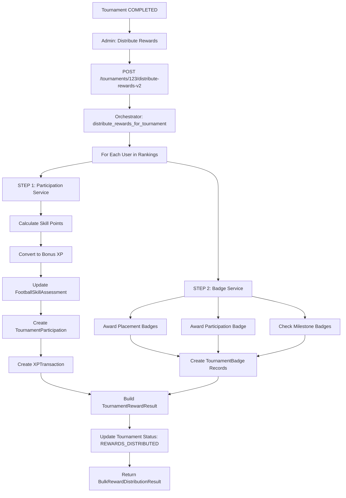

# 🏆 Tournament Reward Architecture - Dual System Design

## Áttekintés

A tornadíjazási rendszer **két külön, de összehangolt alrendszerre** oszlik:

1. **📊 DATA Layer (TournamentParticipation)** - Skill pontok és XP tracking
2. **🎨 UI Layer (TournamentBadge)** - Vizuális achievement-ek és badge-ek

---

## 1. DATA Layer - TournamentParticipation System

### Cél
Skill pontok, XP jutalmak és kredit transakciók **numerikus** követése.

### Adatbázis Tábla: `tournament_participations`

```sql
CREATE TABLE tournament_participations (
    id SERIAL PRIMARY KEY,
    user_id INTEGER REFERENCES users(id),
    semester_id INTEGER REFERENCES semesters(id),
    placement INTEGER,                    -- 1, 2, 3, NULL
    skill_points_awarded JSONB,           -- {"agility": 4.3, "endurance": 2.2}
    xp_awarded INTEGER,                   -- Total XP (base + bonus)
    credits_awarded INTEGER,
    achieved_at TIMESTAMP DEFAULT NOW(),
    UNIQUE(user_id, semester_id)
);
```

### Service: `tournament_participation_service.py`

**Fő funkciók:**
- `calculate_skill_points_for_placement()` - Skill pontok számítása helyezés alapján
- `convert_skill_points_to_xp()` - Skill pontok → XP konverzió
- `update_skill_assessments()` - FootballSkillAssessment tábla frissítése
- `record_tournament_participation()` - Részvétel rögzítése DB-ben
- `get_player_participation_stats()` - Összesítő statisztikák

**Placement-based Skill Points:**
```python
PLACEMENT_SKILL_POINTS = {
    1: 10,   # 1. hely: 10 alap skill pont
    2: 7,    # 2. hely: 7 alap skill pont
    3: 5,    # 3. hely: 5 alap skill pont
    None: 1  # Részvétel: 1 alap skill pont
}
```

**Skill Mapping Példa:**
```json
{
    "tournament_id": 123,
    "skills": [
        {"skill_name": "agility", "category": "Physical", "weight": 1.0},
        {"skill_name": "endurance", "category": "Physical", "weight": 0.5}
    ]
}
```

**Skill Point Distribution:**
- Total weight: 1.0 + 0.5 = 1.5
- 1st place (10 points):
  - Agility: (1.0 / 1.5) * 10 = 6.7 points
  - Endurance: (0.5 / 1.5) * 10 = 3.3 points

### XP Conversion Rates

**Tábla:** `skill_point_conversion_rates`

| Skill Category | XP per Point |
|----------------|--------------|
| Technical      | 10           |
| Tactical       | 10           |
| Physical       | 8            |
| Mental         | 12           |
| football_skill | 10           |

**Példa:**
- Agility (Physical): 6.7 points × 8 XP/point = **53.6 XP bonus**
- Endurance (Physical): 3.3 points × 8 XP/point = **26.4 XP bonus**
- **Total bonus XP: 80 XP** (+ 500 base XP for 1st place)

---

## 2. UI Layer - TournamentBadge System

### Cél
Vizuális achievement-ek megjelenítése profilokban - **ikon + cím + leírás**.

### Adatbázis Tábla: `tournament_badges`

```sql
CREATE TABLE tournament_badges (
    id SERIAL PRIMARY KEY,
    user_id INTEGER REFERENCES users(id),
    semester_id INTEGER REFERENCES semesters(id),
    badge_type VARCHAR(50),              -- CHAMPION, RUNNER_UP, etc.
    badge_category VARCHAR(50),          -- PLACEMENT, ACHIEVEMENT, etc.
    title VARCHAR(200),                  -- "Tournament Champion"
    description TEXT,                    -- "Claimed victory in Speed Test 2026"
    icon VARCHAR(10),                    -- Emoji: 🥇, 🥈, 🥉, 🏆
    rarity VARCHAR(20),                  -- COMMON, RARE, EPIC, LEGENDARY
    badge_metadata JSONB,                -- Extra context
    earned_at TIMESTAMP DEFAULT NOW()
);
```

### Badge Típusok & Kategóriák

#### **PLACEMENT** (Helyezés alapján)
| Type | Icon | Title | Rarity |
|------|------|-------|--------|
| CHAMPION | 🥇 | Champion | EPIC |
| RUNNER_UP | 🥈 | Runner-Up | RARE |
| THIRD_PLACE | 🥉 | Podium Finisher | RARE |
| PODIUM_FINISH | 🏆 | Top 3 Finish | RARE |

#### **PARTICIPATION** (Részvétel)
| Type | Icon | Title | Rarity |
|------|------|-------|--------|
| TOURNAMENT_PARTICIPANT | ⚽ | Tournament Participant | COMMON |
| FIRST_TOURNAMENT | 🌟 | Tournament Debut | UNCOMMON |

#### **ACHIEVEMENT** (Teljesítmények)
| Type | Icon | Title | Rarity |
|------|------|-------|--------|
| UNDEFEATED | 💪 | Undefeated | LEGENDARY |
| COMEBACK_KING | 📈 | Comeback Champion | EPIC |
| CONSISTENCY | 🎯 | Consistency Master | RARE |
| RECORD_BREAKER | ⚡ | Record Breaker | LEGENDARY |

#### **MILESTONE** (Mérföldkövek)
| Type | Icon | Title | Rarity |
|------|------|-------|--------|
| TOURNAMENT_VETERAN | 🎖️ | Tournament Veteran (5+) | RARE |
| TOURNAMENT_LEGEND | 👑 | Tournament Legend (10+) | EPIC |
| TRIPLE_CROWN | 🔥 | Triple Crown (3 wins) | LEGENDARY |

#### **SPECIALIZATION** (Specializációk)
| Type | Icon | Title | Rarity |
|------|------|-------|--------|
| SPEED_DEMON | 🏃 | Speed Demon | EPIC |
| ENDURANCE_MASTER | 🧘 | Endurance Master | EPIC |
| MARKSMAN | 🎯 | Marksman | EPIC |

### Service: `tournament_badge_service.py`

**Fő funkciók:**
- `award_badge()` - Egyedi badge odaítélése
- `award_placement_badges()` - Helyezés szerinti badge-ek
- `award_participation_badge()` - Részvételi badge
- `check_and_award_milestone_badges()` - Mérföldkő badge-ek ellenőrzése
- `get_player_badges()` - Játékos badge-einek lekérdezése
- `get_player_badge_showcase()` - Profil megjelenítéshez

---

## 3. Unified Orchestrator - Koordináció

### Service: `tournament_reward_orchestrator.py`

**Cél:** Mindkét rendszer összehangolt használata egyetlen API híváson keresztül.

### Fő Funkció: `distribute_rewards_for_user()`

```python
def distribute_rewards_for_user(
    db: Session,
    user_id: int,
    tournament_id: int,
    placement: Optional[int],
    total_participants: int,
    reward_policy: RewardPolicy,
    distributed_by: Optional[int]
) -> TournamentRewardResult
```

**Működés (2 lépés párhuzamosan):**

1. **STEP 1: Participation Rewards**
   - Skill pontok számítása
   - XP konverzió (base + bonus)
   - Kredit jutalom
   - `tournament_participations` létrehozása
   - `football_skill_assessments` frissítése
   - `xp_transactions` rögzítése

2. **STEP 2: Badge Rewards**
   - Placement badge-ek (🥇/🥈/🥉/🏆)
   - Participation badge (⚽/🌟)
   - Milestone badge-ek (🎖️/👑/🔥)
   - Achievement badge-ek (💪/📈/🎯/⚡) - **Phase 2**
   - `tournament_badges` létrehozása (többszörös lehetséges)

### Unified DTO: `TournamentRewardResult`

```python
class TournamentRewardResult:
    user_id: int
    tournament_id: int
    tournament_name: str

    # DATA layer
    participation: ParticipationReward {
        placement: int
        skill_points: List[SkillPointsAwarded]
        base_xp: int
        bonus_xp: int
        total_xp: int
        credits: int
    }

    # UI layer
    badges: BadgeReward {
        badges: List[BadgeAwarded]
        total_badges_earned: int
        rarest_badge: str  # "LEGENDARY", "EPIC", etc.
    }

    distributed_at: datetime
    distributed_by: int
```

---

## 4. API Endpoints

### V2 Endpoints (Unified System)

**POST** `/tournaments/{id}/distribute-rewards-v2`
- Teljes jutalom kiosztás mindkét rendszerben
- Visszatér: `BulkRewardDistributionResult`

**GET** `/tournaments/{id}/rewards/{user_id}`
- User jutalmainak lekérdezése
- Visszatér: `TournamentRewardResult`

**POST** `/tournaments/{id}/skill-mappings`
- Skill mapping hozzáadása tornához
- Body: `{"skill_name": "agility", "category": "Physical", "weight": 1.0}`

**GET** `/tournaments/{id}/skill-mappings`
- Torna skill mapping-jeinek listázása

**GET** `/tournaments/badges/user/{user_id}`
- User badge-einek listázása
- Query param: `tournament_id` (optional filter)

**GET** `/tournaments/badges/showcase/{user_id}`
- Badge showcase profilhoz
- Ritkasági sorrendben + kategóriánként

---

## 5. Reward Policy Configuration

### `RewardPolicy` Schema

```python
class RewardPolicy:
    # XP & Credits
    first_place_xp: int = 500
    first_place_credits: int = 100
    second_place_xp: int = 300
    second_place_credits: int = 50
    third_place_xp: int = 200
    third_place_credits: int = 25
    participant_xp: int = 50
    participant_credits: int = 0

    # Skill Points
    first_place_skill_points: int = 10
    second_place_skill_points: int = 7
    third_place_skill_points: int = 5
    participant_skill_points: int = 1
```

**Használat:**
```python
custom_policy = RewardPolicy(
    first_place_xp=1000,  # Double XP event
    first_place_credits=200
)

result = distribute_rewards_for_tournament(
    db, tournament_id,
    reward_policy=custom_policy
)
```

---

## 6. Future Extensibility - Badge Rule System

### Badge Rule Architecture (Not Implemented Yet)

**Cél:** Badge logika kiszervezése service kódból → rule engine.

### Koncepció

```python
class BadgeCondition:
    condition_type: str  # "PLACEMENT", "WIN_STREAK", "IMPROVEMENT"
    parameters: Dict

class BadgeRule:
    badge_type: str
    badge_category: str
    conditions: List[BadgeCondition]
    priority: int
    is_active: bool
```

**Példa Rule:**
```json
{
    "badge_type": "TRIPLE_CROWN",
    "badge_category": "MILESTONE",
    "conditions": [
        {
            "condition_type": "CONSECUTIVE_WINS",
            "parameters": {"min_wins": 3, "placement": 1}
        }
    ],
    "priority": 100,
    "is_active": true
}
```

### Badge Evaluation Context

```python
class BadgeEvaluationContext:
    user_id: int
    tournament_id: int
    placement: int
    total_participants: int

    # Historical data
    previous_tournaments_count: int
    previous_placements: List[int]
    consecutive_wins: int

    # Performance metrics
    improvement_percentage: float
    consistency_score: float
    rounds_won: int
    total_rounds: int
```

**Jövőbeli Implementáció:**
1. Rule-ok betöltése DB-ből vagy config fájlból
2. Evaluation engine minden rule-t kiértékel
3. Priority alapján conflictok feloldása
4. Automatikus badge awarding rule alapján

---

## 7. Migration Path

### Existing System → New System

1. ✅ **Completed**: `tournament_achievements` → `tournament_participations`
2. ✅ **Completed**: `tournament_badges` tábla létrehozása
3. ✅ **Completed**: Orchestrator service
4. ✅ **Completed**: V2 API endpoints
5. ⏳ **Pending**: UI komponensek (admin + player)
6. ⏳ **Pending**: Legacy endpoint átirányítása (optional)

### Backfill Strategy

**Meglévő tornák:**
- `tournament_participations` rekordok létrehozása meglévő `tournament_rankings` alapján
- Skill points: üres marad (nincs mapping)
- Badge-ek: lehet visszamenőleg odaítélni placement alapján

---

## 8. Database Schema Diagram

```
┌─────────────────────────────┐
│      semesters              │
│  (tournaments)              │
└─────────────┬───────────────┘
              │
              │ 1:N
              │
    ┌─────────┴────────────┐
    │                      │
    │                      │
┌───▼──────────────────┐  ┌▼──────────────────────┐
│ tournament_skill_    │  │ tournament_rankings   │
│ mappings             │  │                       │
│                      │  │ (generated from       │
│ - skill_name         │  │  match results)       │
│ - skill_category     │  └───────────┬───────────┘
│ - weight             │              │
└──────────────────────┘              │ Used by
                                      │ orchestrator
                                      │
                    ┌─────────────────┴─────────────────┐
                    │                                   │
                    │                                   │
        ┌───────────▼────────────────┐    ┌────────────▼─────────────┐
        │ tournament_participations  │    │  tournament_badges       │
        │                            │    │                          │
        │ - placement                │    │  - badge_type            │
        │ - skill_points_awarded     │    │  - badge_category        │
        │ - xp_awarded               │    │  - title                 │
        │ - credits_awarded          │    │  - description           │
        └────────────────────────────┘    │  - icon                  │
                                          │  - rarity                │
                                          │  - badge_metadata        │
                                          └──────────────────────────┘

             (1 per user/tournament)         (Multiple per user/tournament)
             DATA LAYER                       UI LAYER
```

---

## 9. Example Flow: Tournament Completion



---

## 10. Testing Checklist

### Unit Tests
- ✅ Skill point calculation
- ✅ XP conversion
- ✅ Badge awarding logic
- ✅ Placement badge rules
- ✅ Milestone detection

### Integration Tests
- ⏳ Full reward distribution flow
- ⏳ Skill mapping CRUD
- ⏳ Badge showcase generation
- ⏳ User reward summary retrieval

### E2E Tests
- ⏳ Create tournament → Add skill mappings → Complete → Distribute → Verify
- ⏳ Check player profile displays badges
- ⏳ Verify XP/credit balances updated

---

## 11. Performance Considerations

### Optimization Strategies

1. **Batch Processing**
   - Bulk distribute rewards (not one-by-one API calls)
   - Use DB transactions

2. **Caching**
   - Skill conversion rates (rarely change)
   - Badge definitions (static)

3. **Indexing**
   - `tournament_participations(user_id, semester_id)` - UNIQUE
   - `tournament_badges(user_id)` - for profile queries
   - `tournament_badges(badge_type)` - for filtering

4. **Async Background Jobs** (Future)
   - Large tournaments (100+ participants)
   - Run distribution as background job
   - Send notification when complete

---

## 12. Security & Authorization

### API Permissions

| Endpoint | Role Required |
|----------|---------------|
| `POST /distribute-rewards-v2` | Admin, Instructor |
| `GET /rewards/{user_id}` | Self or Admin/Instructor |
| `POST /skill-mappings` | Admin |
| `GET /skill-mappings` | Any authenticated |
| `GET /badges/user/{id}` | Self or Admin/Instructor |
| `GET /badges/showcase/{id}` | Self or Admin/Instructor |

### Data Privacy
- Users can only view their own rewards/badges
- Admins/Instructors can view all
- No PII in badge metadata

---

## 13. Monitoring & Analytics

### Metrics to Track

- Total rewards distributed per tournament
- Average skill points per placement
- Badge distribution by type
- Rarest badges awarded
- XP inflation rate
- Skill point → XP conversion efficiency

### Dashboard Ideas

- **Admin Dashboard:**
  - Tournament completion rate
  - Reward distribution status
  - Skill mapping coverage

- **Player Dashboard:**
  - Total XP earned from tournaments
  - Badge collection progress
  - Skill improvement trends

---

## Summary

Ez az architektúra:
- ✅ **Szétválasztja** a DATA (skill/XP) és UI (badge) rétegeket
- ✅ **Egységes interface** - `TournamentRewardResult` DTO
- ✅ **Orchestrator pattern** - mindkét rendszert koordinálja
- ✅ **Jövőbeni bővíthetőség** - Badge Rule System
- ✅ **Backward compatible** - régi reward endpoint továbbra is működik
- ✅ **RESTful API design** - V2 endpoints
