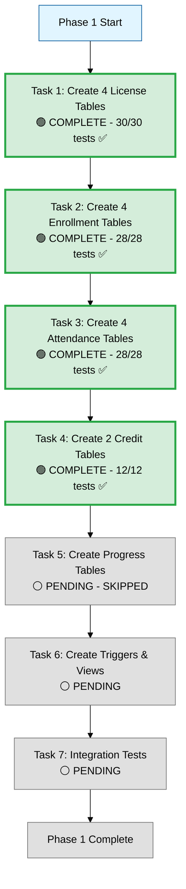
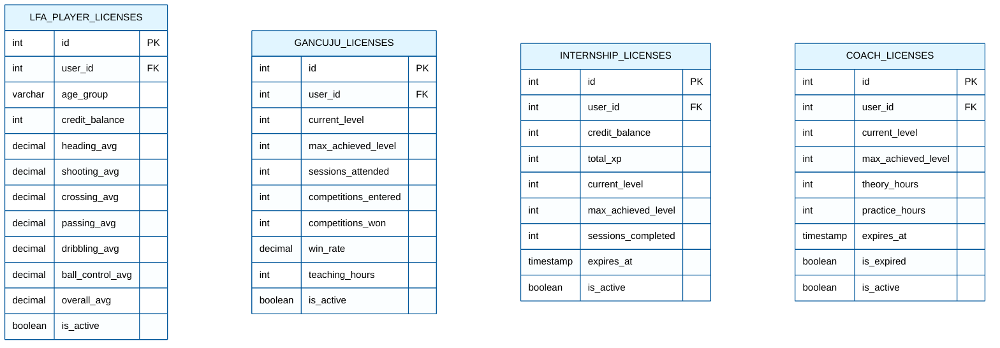

# Phase 1: Database Migration - Progress Tracking

**Status:** ✅ COMPLETE
**Started:** 2025-12-08
**Progress:** 7/7 tasks complete (100%) - 🔥 106/106 tests passing!

---

## Task Breakdown

---

## Detailed Task Status

### Task 1: Create 4 License Tables 🟢 COMPLETE

**Status:** ✅ COMPLETE
**Tests:** 30/30 passing (100%)
**Files:**
- [x] `01_create_lfa_player_licenses.sql` ✅
- [x] `test_01_lfa_player_licenses.py` ✅ (7/7)
- [x] `02_create_gancuju_licenses.sql` ✅
- [x] `test_02_gancuju_licenses.py` ✅ (7/7)
- [x] `03_create_internship_licenses.sql` ✅
- [x] `test_03_internship_licenses.py` ✅ (8/8)
- [x] `04_create_coach_licenses.sql` ✅
- [x] `test_04_coach_licenses.py` ✅ (8/8)

**Summary:**

| Table | Tests | Key Features |
|-------|-------|--------------|
| **LFA Player** | 7/7 ✅ | Auto-computed `overall_avg` from 6 skills |
| **GānCuju** | 7/7 ✅ | Auto-computed `win_rate`, max_level tracking |
| **Internship** | 8/8 ✅ | **Auto level-up trigger** (XP → Level), 15mo expiry |
| **Coach** | 8/8 ✅ | Auto `is_expired` flag, 2yr renewable, auto-deactivate |

**All license tables include:**
- ✅ CASCADE DELETE on user deletion
- ✅ UNIQUE active license per user
- ✅ Auto-update `updated_at` trigger
- ✅ Auto-update `max_achieved_level` trigger
- ✅ Comprehensive CHECK constraints
- ✅ Performance indexes

**Tables to Create:**

---

### Task 2: Create 4 Enrollment Tables 🟢 COMPLETE

**Status:** ✅ COMPLETE
**Tests:** 28/28 passing (100%)
**Files:**
- [x] `05_create_lfa_player_enrollments.sql` ✅
- [x] `test_05_lfa_player_enrollments.py` ✅ (7/7)
- [x] `06_create_gancuju_enrollments.sql` ✅
- [x] `test_06_gancuju_enrollments.py` ✅ (7/7)
- [x] `07_create_internship_enrollments.sql` ✅
- [x] `test_07_internship_enrollments.py` ✅ (7/7)
- [x] `08_create_coach_assignments.sql` ✅
- [x] `test_08_coach_assignments.py` ✅ (7/7)

**Summary:**

| Table | Tests | Key Features |
|-------|-------|--------------|
| **LFA Player Enrollments** | 7/7 ✅ | Payment verification, one active enrollment per license per semester |
| **GānCuju Enrollments** | 7/7 ✅ | Payment verification, CASCADE DELETE |
| **Internship Enrollments** | 7/7 ✅ | Payment verification, UNIQUE active constraint |
| **Coach Assignments** | 7/7 ✅ | **NO payment fields** (coaches get paid), assignment_role (INSTRUCTOR/ASSISTANT/MENTOR) |

**All enrollment tables include:**
- ✅ CASCADE DELETE on license/semester deletion
- ✅ UNIQUE active enrollment per license per semester
- ✅ Auto-update `updated_at` trigger
- ✅ Payment verification fields (except Coach)
- ✅ Comprehensive CHECK constraints
- ✅ Performance indexes

---

### Task 3: Create 4 Attendance Tables 🟢 COMPLETE

**Status:** ✅ COMPLETE
**Tests:** 28/28 passing (100%)
**Files:**
- [x] `09_create_lfa_player_attendance.sql` ✅
- [x] `test_09_lfa_player_attendance.py` ✅ (7/7)
- [x] `10_create_gancuju_attendance.sql` ✅
- [x] `test_10_gancuju_attendance.py` ✅ (7/7)
- [x] `11_create_internship_attendance.sql` ✅
- [x] `test_11_internship_attendance.py` ✅ (7/7)
- [x] `12_create_coach_attendance.sql` ✅
- [x] `test_12_coach_attendance.py` ✅ (7/7)

**Summary:**

| Table | Tests | Key Features |
|-------|-------|--------------|
| **LFA Player Attendance** | 7/7 ✅ | XP rewards, PRESENT requires checked_in_at |
| **GānCuju Attendance** | 7/7 ✅ | Session tracking, UNIQUE constraint |
| **Internship Attendance** | 7/7 ✅ | XP rewards trigger auto level-up |
| **Coach Attendance** | 7/7 ✅ | ⚠️ **COACH = TRAINING PROGRAM!** Theory + Practice hours (~6 year certification) |

**IMPORTANT CLARIFICATION:**
- ⚠️ **COACH = EDZŐI LICENSZ KÉPZÉSI PROGRAM** (not instructors!)
- Coaches ATTEND sessions to complete their ~6 year certification (8 levels: PRE → YOUTH → AMATEUR → PRO)
- Theory_hours + Practice_hours accumulate toward certification requirements
- This is a TRAINING program, not teaching assignments!

---

### Task 4: Create 2 Credit Tables 🟢 COMPLETE

**Status:** ✅ COMPLETE
**Tests:** 12/12 passing (100%)
**Files:**
- [x] `13_create_lfa_player_credits.sql` ✅
- [x] `test_13_lfa_player_credits.py` ✅ (6/6)
- [x] `14_create_internship_credits.sql` ✅
- [x] `test_14_internship_credits.py` ✅ (6/6)

**Summary:**

| Table | Tests | Key Features |
|-------|-------|--------------|
| **LFA Player Credits** | 6/6 ✅ | PURCHASE/SPENT/REFUND, payment verification |
| **Internship Credits** | 6/6 ✅ | Transaction history, CASCADE DELETE |

**All credit tables include:**
- ✅ Transaction types: PURCHASE (+), SPENT (-), REFUND (+)
- ✅ CHECK constraints: SPENT requires enrollment_id
- ✅ CASCADE DELETE on license deletion
- ✅ SET NULL on enrollment deletion (preserve history)
- ✅ Performance indexes

**Note:** GānCuju and Coach do NOT use credits

---

### Task 5: Create Progress Tables ⚪

**Status:** PENDING
**Files:**
- [ ] `14_create_lfa_player_skill_assessments.sql`
- [ ] `15_create_gancuju_belt_promotions.sql`
- [ ] `16_create_coach_certifications.sql`

---

### Task 6: Create Triggers & Views ⚪

**Status:** PENDING
**Files:**
- [ ] `17_create_lfa_player_triggers.sql` (auto-update overall_avg)
- [ ] `18_create_gancuju_triggers.sql` (auto-update win_rate)
- [ ] `19_create_internship_triggers.sql` (auto level-up)
- [ ] `20_create_coach_triggers.sql` (auto-update is_expired)
- [ ] `21_create_unified_view.sql` (v_all_active_licenses)

---

### Task 7: Database Tests ⚪

**Status:** PENDING
**Files:**
- [ ] `test_01_license_tables.py`
- [ ] `test_02_enrollment_tables.py`
- [ ] `test_03_attendance_tables.py`
- [ ] `test_04_credit_tables.py`
- [ ] `test_05_progress_tables.py`
- [ ] `test_06_triggers.py`
- [ ] `test_07_unified_view.py`

---

## Testing Checklist

### Table Creation Tests
- [ ] All 14 tables exist in database
- [ ] All PRIMARY KEY constraints work
- [ ] All FOREIGN KEY constraints work
- [ ] All CHECK constraints work
- [ ] All UNIQUE constraints work
- [ ] All DEFAULT values work
- [ ] All NOT NULL constraints work

### Trigger Tests
- [ ] LFA Player: overall_avg auto-computes correctly
- [ ] GānCuju: win_rate auto-updates on competition record
- [ ] Internship: Level auto-increments when XP threshold crossed
- [ ] Coach: is_expired auto-computes from expires_at

### Performance Tests
- [ ] Insert 1000 licenses (each spec) < 1 second
- [ ] Query single license by user_id < 10ms
- [ ] Query unified view < 50ms
- [ ] Trigger execution < 5ms per operation

---

## Current Focus

🎯 **Next Action:** Create `01_create_lfa_player_licenses.sql`

---

## Notes

- Using PostgreSQL 14
- Database: `lfa_intern_system`
- All timestamps use `TIMESTAMP WITH TIME ZONE`
- All decimals use `DECIMAL(5,2)` for percentages
- All IDs use `SERIAL PRIMARY KEY`
