# Phase 2: Backend Services - Progress Tracking

**Status:** ✅ COMPLETE
**Started:** 2025-12-08
**Completed:** 2025-12-08
**Progress:** 4/4 tasks complete (100%) - Phase 2 COMPLETE!

---

## Task Breakdown

```mermaid
%%{init: {'theme':'base', 'themeVariables': {'primaryColor':'#e1f5ff','primaryTextColor':'#000','primaryBorderColor':'#01579b'}}}%%
graph TB
    START[Phase 2 Start] --> T1

    T1[Task 1: LFA Player Service<br/>✅ COMPLETE]
    T2[Task 2: GānCuju Service<br/>✅ COMPLETE]
    T3[Task 3: Internship Service<br/>✅ COMPLETE]
    T4[Task 4: Coach Service<br/>✅ COMPLETE]

    T1 --> T2
    T2 --> T3
    T3 --> T4
    T4 --> COMPLETE[Phase 2 Complete ✅]

    style T1 fill:#c8e6c9,stroke:#2e7d32,stroke-width:3px,color:#000
    style T2 fill:#c8e6c9,stroke:#2e7d32,stroke-width:3px,color:#000
    style T3 fill:#c8e6c9,stroke:#2e7d32,stroke-width:3px,color:#000
    style T4 fill:#c8e6c9,stroke:#2e7d32,stroke-width:3px,color:#000
    style COMPLETE fill:#4caf50,stroke:#1b5e20,stroke-width:4px,color:#fff
```

---

## Detailed Task Status

### Task 1: LFA Player Service ✅ COMPLETE

**Goal:** Create service layer for LFA Player license management

**Files created:**
- [x] `lfa_player_service.py` - Core service logic (453 lines)
- [x] `test_lfa_player_service.py` - Unit tests (7/7 passing)

**Service Methods:**
- [x] `create_license(user_id, age_group)` - Create new LFA Player license
- [x] `get_license_by_user(user_id)` - Get active license for user
- [x] `update_skill_avg(license_id, skill_name, new_avg)` - Update skill average
- [x] `purchase_credits(license_id, amount, payment_info)` - Buy credits
- [x] `spend_credits(license_id, enrollment_id, amount)` - Use credits
- [x] `get_credit_balance(license_id)` - Get current balance
- [x] `get_transaction_history(license_id)` - Get credit history

**Test Results:** ✅ 7/7 tests passing

---

### Task 2: GānCuju Service ✅ COMPLETE

**Goal:** Create service layer for GānCuju license management

**Files created:**
- [x] `gancuju_service.py` - Core service logic (313 lines)
- [x] `test_gancuju_service.py` - Unit tests (8/8 passing)

**Service Methods:**
- [x] `create_license(user_id, starting_level)` - Create license with level 1-8
- [x] `get_license_by_user(user_id)` - Get active license
- [x] `promote_level(license_id)` - Advance to next level (1→8)
- [x] `demote_level(license_id)` - Drop to previous level
- [x] `record_competition(license_id, won: bool)` - Track competition results
- [x] `record_teaching_hours(license_id, hours)` - Track teaching hours
- [x] `get_license_stats(license_id)` - Get comprehensive statistics

**Test Results:** ✅ 8/8 tests passing

---

### Task 3: Internship Service ✅ COMPLETE

**Goal:** Create service layer for Internship license management

**Files created:**
- [x] `internship_service.py` - Core service logic (420 lines)
- [x] `test_internship_service.py` - Unit tests (8/8 passing)

**Service Methods:**
- [x] `create_license(user_id, initial_credits)` - Create with 15-month expiry
- [x] `get_license_by_user(user_id)` - Get active license
- [x] `add_xp(license_id, xp_amount)` - Add XP (triggers auto level-up via trigger)
- [x] `check_expiry(license_id)` - Check expiry status
- [x] `renew_license(license_id)` - Extend by months
- [x] `purchase_credits(license_id, amount)` - Purchase credits
- [x] `spend_credits(license_id, enrollment_id, amount)` - Spend credits
- [x] `get_credit_balance(license_id)` - Get balance

**Test Results:** ✅ 8/8 tests passing

---

### Task 4: Coach Service ✅ COMPLETE

**Goal:** Create service layer for Coach license management

**Files created:**
- [x] `coach_service.py` - Core service logic (390 lines)
- [x] `test_coach_service.py` - Unit tests (9/9 passing)

**Service Methods:**
- [x] `create_license(user_id, starting_level)` - Create with 2-year expiry
- [x] `get_license_by_user(user_id)` - Get active license
- [x] `add_theory_hours(license_id, hours)` - Track theory training
- [x] `add_practice_hours(license_id, hours)` - Track practical training
- [x] `check_expiry(license_id)` - Check certification expiry
- [x] `renew_certification(license_id)` - Extend by years
- [x] `promote_level(license_id)` - Advance certification level (1→8)
- [x] `get_license_stats(license_id)` - Get comprehensive stats

**Test Results:** ✅ 9/9 tests passing

---

## Architecture

```mermaid
%%{init: {'theme':'base', 'themeVariables': {'primaryColor':'#e1f5ff','primaryTextColor':'#000','primaryBorderColor':'#01579b'}}}%%
graph TD
    subgraph "Service Layer"
        LFA[LFA Player Service]
        GC[GānCuju Service]
        INT[Internship Service]
        COACH[Coach Service]
    end

    subgraph "Database Layer"
        LFA_DB[(lfa_player_licenses)]
        GC_DB[(gancuju_licenses)]
        INT_DB[(internship_licenses)]
        COACH_DB[(coach_licenses)]
    end

    LFA --> LFA_DB
    GC --> GC_DB
    INT --> INT_DB
    COACH --> COACH_DB

    style LFA fill:#c8e6c9,stroke:#2e7d32
    style GC fill:#c8e6c9,stroke:#2e7d32
    style INT fill:#c8e6c9,stroke:#2e7d32
    style COACH fill:#c8e6c9,stroke:#2e7d32
```

---

## Next Action

🎯 **Starting:** Create `gancuju_service.py` with belt progression logic!
