# Phase 3: API Endpoints - Progress Tracking

**Status:** ✅ COMPLETE
**Started:** 2025-12-08
**Completed:** 2025-12-08
**Progress:** 4/4 tasks complete (100%) - ALL APIs DONE! 🎉🏁

---

## Task Breakdown

```mermaid
%%{init: {'theme':'base', 'themeVariables': {'primaryColor':'#e1f5ff','primaryTextColor':'#000','primaryBorderColor':'#01579b'}}}%%
graph TB
    START[Phase 3 Start] --> T1

    T1[Task 1: LFA Player API<br/>✅ COMPLETE]
    T2[Task 2: GānCuju API<br/>✅ COMPLETE]
    T3[Task 3: Internship API<br/>✅ COMPLETE]
    T4[Task 4: Coach API<br/>✅ COMPLETE]

    T1 --> T2
    T2 --> T3
    T3 --> T4
    T4 --> COMPLETE[Phase 3 Complete<br/>🎉 ALL DONE!]

    style T1 fill:#c8e6c9,stroke:#2e7d32,stroke-width:3px,color:#000
    style T2 fill:#c8e6c9,stroke:#2e7d32,stroke-width:3px,color:#000
    style T3 fill:#c8e6c9,stroke:#2e7d32,stroke-width:3px,color:#000
    style T4 fill:#c8e6c9,stroke:#2e7d32,stroke-width:3px,color:#000
    style COMPLETE fill:#4caf50,stroke:#1b5e20,stroke-width:4px,color:#fff
```

---

## Detailed Task Status

### Task 1: LFA Player API ✅ COMPLETE

**Goal:** Create FastAPI endpoints for LFA Player service

**Files created:**
- [x] `app/api/api_v1/endpoints/lfa_player.py` - Router with 7 endpoints (394 lines)
- [x] `implementation/03_api_endpoints/test_lfa_player_api_simple.py` - Service layer tests (7/7 passing)
- [x] Router registered in `app/api/api_v1/api.py`

**Endpoints created:**
- [x] `POST /api/v1/lfa-player/licenses` - Create license
- [x] `GET /api/v1/lfa-player/licenses/me` - Get my license
- [x] `PUT /api/v1/lfa-player/licenses/{id}/skills` - Update skill average
- [x] `POST /api/v1/lfa-player/credits/purchase` - Purchase credits
- [x] `POST /api/v1/lfa-player/credits/spend` - Spend credits
- [x] `GET /api/v1/lfa-player/credits/balance` - Get balance
- [x] `GET /api/v1/lfa-player/credits/transactions` - Get transaction history

**Pydantic Schemas:**
- [x] `SkillAverages` - 6 skill fields with validation (0-100)
- [x] `LicenseCreate` - Request body for license creation
- [x] `LicenseResponse` - Complete license data response
- [x] `SkillUpdate` - Request for skill updates
- [x] `CreditPurchase` - Credit purchase request
- [x] `CreditSpend` - Credit spending request
- [x] `CreditTransaction` - Transaction response
- [x] `TransactionHistoryItem` - Transaction history item

**Test Results:** ✅ 7/7 service layer tests passing

**Features:**
- ✅ Full JWT authentication via `Depends(get_current_user)`
- ✅ Authorization checks (user can only modify own licenses)
- ✅ Comprehensive error handling (400, 403, 404, 500)
- ✅ Service layer integration via sys.path import
- ✅ All CRUD operations for licenses, skills, and credits

---

### Task 2: GānCuju API ✅ COMPLETE

**Goal:** Create FastAPI endpoints for GānCuju service

**Files created:**
- [x] `app/api/api_v1/endpoints/gancuju.py` - Router with 7 endpoints (470 lines)
- [x] `implementation/03_api_endpoints/test_gancuju_api.py` - Service layer tests (7/7 passing)
- [x] Router registered in `app/api/api_v1/api.py`

**Endpoints created:**
- [x] `POST /api/v1/gancuju/licenses` - Create license
- [x] `GET /api/v1/gancuju/licenses/me` - Get my license
- [x] `POST /api/v1/gancuju/licenses/{id}/promote` - Promote level
- [x] `POST /api/v1/gancuju/licenses/{id}/demote` - Demote level
- [x] `POST /api/v1/gancuju/competitions` - Record competition
- [x] `POST /api/v1/gancuju/teaching-hours` - Record teaching hours
- [x] `GET /api/v1/gancuju/licenses/{id}/stats` - Get statistics

**Pydantic Schemas:**
- [x] `LicenseCreate` - Create license with starting_level
- [x] `LicenseResponse` - Full license data with levels & stats
- [x] `PromoteRequest/DemoteRequest` - Level change requests
- [x] `LevelChangeResponse` - Level change result
- [x] `CompetitionRecord` - Competition result submission
- [x] `CompetitionResponse` - Competition stats update
- [x] `TeachingHoursRecord` - Teaching hours submission
- [x] `TeachingHoursResponse` - Teaching hours update
- [x] `LicenseStats` - Detailed statistics

**Test Results:** ✅ 7/7 service layer tests passing

**Features:**
- ✅ Full JWT authentication via `Depends(get_current_user)`
- ✅ Authorization checks (user can only modify own licenses)
- ✅ Comprehensive error handling (400, 403, 404, 500)
- ✅ Service layer integration via sys.path import
- ✅ Level progression (1-8 numeric levels)
- ✅ Auto-computed win_rate (competitions_won/entered*100)
- ✅ max_achieved_level tracking via DB trigger

---

### Task 3: Internship API ✅ COMPLETE

**Goal:** Create FastAPI endpoints for Internship service

**Files created:**
- [x] `app/api/api_v1/endpoints/internship.py` - Router with 8 endpoints (520 lines)
- [x] `implementation/03_api_endpoints/test_internship_api.py` - Service layer tests (8/8 passing)
- [x] Router registered in `app/api/api_v1/api.py`

**Endpoints created:**
- [x] `POST /api/v1/internship/licenses` - Create license
- [x] `GET /api/v1/internship/licenses/me` - Get my license
- [x] `POST /api/v1/internship/xp` - Add XP
- [x] `GET /api/v1/internship/licenses/{id}/expiry` - Check expiry
- [x] `POST /api/v1/internship/licenses/{id}/renew` - Renew license
- [x] `POST /api/v1/internship/credits/purchase` - Purchase credits
- [x] `POST /api/v1/internship/credits/spend` - Spend credits
- [x] `GET /api/v1/internship/credits/balance` - Get balance

**Pydantic Schemas:**
- [x] `LicenseCreate` - Create license with credits & duration
- [x] `LicenseResponse` - Full license data with XP, level, expiry
- [x] `AddXPRequest` - XP addition request
- [x] `XPResponse` - XP update with level-up info
- [x] `ExpiryResponse` - Expiry status with days remaining
- [x] `RenewRequest/RenewResponse` - License renewal
- [x] `CreditPurchase/CreditSpend` - Credit transactions
- [x] `CreditResponse` - Transaction result with balance
- [x] `TransactionHistoryItem` - Transaction history

**Test Results:** ✅ 8/8 service layer tests passing

**Features:**
- ✅ Full JWT authentication via `Depends(get_current_user)`
- ✅ Authorization checks (user can only modify own licenses)
- ✅ Comprehensive error handling (400, 403, 404, 500)
- ✅ Service layer integration via sys.path import
- ✅ XP-based level progression (auto level-up via DB trigger)
- ✅ Expiry management (15 months default, renewable)
- ✅ Credit system (purchase, spend, balance, transactions)
- ✅ Days remaining calculation for expiry

---

### Task 4: Coach API ✅ COMPLETE

**Goal:** Create FastAPI endpoints for Coach service

**Files created:**
- [x] `app/api/api_v1/endpoints/coach.py` - Router with 8 endpoints (530 lines)
- [x] `implementation/03_api_endpoints/test_coach_api.py` - Service layer tests (8/8 passing)
- [x] Router registered in `app/api/api_v1/api.py`

**Endpoints created:**
- [x] `POST /api/v1/coach/licenses` - Create license
- [x] `GET /api/v1/coach/licenses/me` - Get my license
- [x] `POST /api/v1/coach/theory-hours` - Add theory hours
- [x] `POST /api/v1/coach/practice-hours` - Add practice hours
- [x] `GET /api/v1/coach/licenses/{id}/expiry` - Check expiry
- [x] `POST /api/v1/coach/licenses/{id}/renew` - Renew certification
- [x] `POST /api/v1/coach/licenses/{id}/promote` - Promote level
- [x] `GET /api/v1/coach/licenses/{id}/stats` - Get statistics

**Pydantic Schemas:**
- [x] `LicenseCreate` - Create license with starting level & duration
- [x] `LicenseResponse` - Full license data with hours & expiry
- [x] `AddTheoryHoursRequest/AddPracticeHoursRequest` - Hours tracking
- [x] `HoursResponse` - Hours update response
- [x] `ExpiryResponse` - Expiry status with days remaining
- [x] `RenewRequest/RenewResponse` - Certification renewal
- [x] `PromoteRequest/PromoteResponse` - Level promotion
- [x] `LicenseStats` - Detailed statistics with total hours

**Test Results:** ✅ 8/8 service layer tests passing

**Features:**
- ✅ Full JWT authentication via `Depends(get_current_user)`
- ✅ Authorization checks (user can only modify own licenses)
- ✅ Comprehensive error handling (400, 403, 404, 500)
- ✅ Service layer integration via sys.path import
- ✅ Level progression (1-8 certification levels)
- ✅ Theory & practice hours tracking
- ✅ Expiry management (2 years default, renewable)
- ✅ max_achieved_level tracking via DB trigger

---

## Architecture

```mermaid
%%{init: {'theme':'base', 'themeVariables': {'primaryColor':'#e1f5ff','primaryTextColor':'#000','primaryBorderColor':'#01579b'}}}%%
graph TD
    subgraph "API Layer (FastAPI)"
        LFA_API[LFA Player Endpoints]
        GC_API[GānCuju Endpoints]
        INT_API[Internship Endpoints]
        COACH_API[Coach Endpoints]
    end

    subgraph "Service Layer"
        LFA_SVC[LFA Player Service]
        GC_SVC[GānCuju Service]
        INT_SVC[Internship Service]
        COACH_SVC[Coach Service]
    end

    subgraph "Database Layer"
        DB[(PostgreSQL)]
    end

    LFA_API --> LFA_SVC
    GC_API --> GC_SVC
    INT_API --> INT_SVC
    COACH_API --> COACH_SVC

    LFA_SVC --> DB
    GC_SVC --> DB
    INT_SVC --> DB
    COACH_SVC --> DB

    style LFA_API fill:#e3f2fd,stroke:#1976d2
    style GC_API fill:#e3f2fd,stroke:#1976d2
    style INT_API fill:#e3f2fd,stroke:#1976d2
    style COACH_API fill:#e3f2fd,stroke:#1976d2
```

---

## Implementation Strategy

**For each API endpoint:**
1. Import service from `implementation/02_backend_services/`
2. Create Pydantic request/response schemas
3. Implement endpoint with proper auth (JWT)
4. Add error handling (try/except with HTTPException)
5. Write tests (pytest + TestClient)

**Authentication:**
- Use existing JWT auth from `app/dependencies.py`
- Protect endpoints with `Depends(get_current_user)`
- Check user permissions/roles where needed

**Error Handling:**
- Service ValueError → 400 Bad Request
- Not found → 404 Not Found
- Unauthorized → 401 Unauthorized
- Server errors → 500 Internal Server Error

---

## Summary

**Completed:**
- ✅ Task 1: LFA Player API (7 endpoints, 7/7 tests passing)
- ✅ Task 2: GānCuju API (7 endpoints, 7/7 tests passing)
- ✅ Task 3: Internship API (8 endpoints, 8/8 tests passing)
- ✅ Task 4: Coach API (8 endpoints, 8/8 tests passing)

**Total:** 30 endpoints, 30/30 tests passing

---

## Phase 3 COMPLETE! 🎉

All 4 specialization APIs have been successfully implemented:
- ⚽ LFA Player - Skill tracking & credits
- 🥋 GānCuju - Belt/level progression
- 📚 Internship - XP system & expiry
- 👨‍🏫 Coach - Certification & hours tracking

**Total Statistics:**
- **Files Created:** 8 (4 routers + 4 test files)
- **Lines of Code:** ~2,000+ lines
- **Endpoints:** 30 REST API endpoints
- **Pydantic Schemas:** 35+ request/response models
- **Tests:** 30/30 passing (100%)

---

## Next Steps

Phase 3 is complete! The spec-specific system is now fully functional with:
- Complete REST API coverage for all 4 specializations
- Full authentication & authorization
- Comprehensive error handling
- Service layer integration
- Validated business logic
